# 面试准备：智能体（Agent）Harness 工程

> 基于 learn-claude-code 项目（s01–s20）整理的面试问答指南。

---

## 全章概览：s01–s20 逐章演进

> 每一章都回答一个问题：**"当前的 Agent 还缺什么？"** 下面用流程图说明每章新增功能的来龙去脉。

```mermaid
graph TB
    subgraph 基础层["🏗️ 基础层：让 Agent 能跑起来"]
        s01["s01 Agent 核心循环<br/>问题：模型输出命令后不会自己执行<br/>→ 加 while True 循环，自动执行工具并喂回结果"]
        s02["s02 工具系统<br/>问题：只有 bash，读文件要拼 cat 命令<br/>→ 加 read_file / write_file / edit_file / glob<br/>+ TOOL_HANDLERS 字典分发机制"]
        s03["s03 权限系统<br/>问题：bash 可以执行 rm -rf /<br/>→ 加三道闸门：硬禁用 + 规则匹配 + 用户确认"]
        s04["s04 Hooks 钩子<br/>问题：每次加功能都要改主循环代码<br/>→ 事件驱动 hook 机制，权限/日志挂在回调上"]
    end

    subgraph 规划层["📋 规划层：让 Agent 会思考"]
        s05["s05 TodoWrite<br/>问题：Agent 执行复杂任务时容易跑偏<br/>→ 加 todo_write 工具 + nag 提醒机制"]
        s06["s06 子智能体<br/>问题：messages 越来越长，中间过程占上下文<br/>→ spawn_subagent 派生独立 Agent，只返回结论"]
        s07["s07 技能加载<br/>问题：所有规范文档塞进 system prompt 浪费 token<br/>→ 两级加载：启动时注入目录 + 运行时按需加载内容"]
        s08["s08 上下文压缩<br/>问题：messages 堆满后 API 直接报错<br/>→ 四层压缩管线：budget → snip → micro → compact_history"]
    end

    subgraph 记忆层["🧠 记忆层：让 Agent 不丢信息"]
        s09["s09 记忆系统<br/>问题：压缩后用户偏好和约束随摘要丢失<br/>→ .memory/ 文件系统记忆，跨会话持久化"]
        s10["s10 提示词组装<br/>问题：system prompt 硬编码，换项目要重写<br/>→ PROMPT_SECTIONS 分段 + 按需拼接 + 缓存"]
        s11["s11 错误恢复<br/>问题：遇到 529/429 直接崩溃<br/>→ with_retry + 指数退避 + 模型切换 + 输出续写"]
    end

    subgraph 任务层["⚙️ 任务层：让 Agent 能干大事"]
        s12["s12 任务系统<br/>问题：TodoWrite 在内存中，跨会话丢失<br/>→ 文件持久化 DAG 任务图 + blockedBy 依赖"]
        s13["s13 后台任务<br/>问题：pip install 等慢操作阻塞主循环<br/>→ daemon 线程异步执行，结果通过通知注入"]
        s14["s14 定时调度<br/>问题：周期性任务需要人手动触发<br/>→ cron 守护线程 + 队列消费 + 重启恢复"]
    end

    subgraph 协作层["👥 协作层：让多个 Agent 一起干"]
        s15["s15 智能体团队<br/>问题：子 Agent 用完即销毁，无法持续协作<br/>→ MessageBus 文件收件箱 + spawn_teammate 线程"]
        s16["s16 团队协议<br/>问题：关机直接杀线程，文件写到一半就没了<br/>→ request_id 关联的请求-响应协议"]
        s17["s17 自主智能体<br/>问题：Lead 要手动给每个队友分配任务<br/>→ WORK/IDLE 生命周期 + idle_poll 自动认领"]
        s18["s18 Worktree 隔离<br/>问题：Alice 和 Bob 改同一个文件互相覆盖<br/>→ git worktree 每个任务独立目录+分支"]
    end

    subgraph 扩展层["🔌 扩展层：让 Agent 能力可增长"]
        s19["s19 MCP 插件<br/>问题：接入外部服务要重写一套工具代码<br/>→ MCP 标准协议 + connect_mcp 动态发现工具"]
        s20["s20 综合智能体<br/>问题：前19章各自独立，无法协同工作<br/>→ 全部机制合入同一个 agent_loop"]
    end

    s01 --> s02 --> s03 --> s04 --> s05 --> s06 --> s07 --> s08
    s08 --> s09 --> s10 --> s11
    s11 --> s12 --> s13 --> s14
    s14 --> s15 --> s16 --> s17 --> s18
    s18 --> s19 --> s20

    style s01 fill:#e1f5fe,stroke:#01579b
    style s02 fill:#e1f5fe,stroke:#01579b
    style s03 fill:#e1f5fe,stroke:#01579b
    style s04 fill:#e1f5fe,stroke:#01579b
    style s05 fill:#fff3e0,stroke:#e65100
    style s06 fill:#fff3e0,stroke:#e65100
    style s07 fill:#fff3e0,stroke:#e65100
    style s08 fill:#fff3e0,stroke:#e65100
    style s09 fill:#f3e5f5,stroke:#4a148c
    style s10 fill:#f3e5f5,stroke:#4a148c
    style s11 fill:#f3e5f5,stroke:#4a148c
    style s12 fill:#e8f5e9,stroke:#1b5e20
    style s13 fill:#e8f5e9,stroke:#1b5e20
    style s14 fill:#e8f5e9,stroke:#1b5e20
    style s15 fill:#fce4ec,stroke:#880e4f
    style s16 fill:#fce4ec,stroke:#880e4f
    style s17 fill:#fce4ec,stroke:#880e4f
    style s18 fill:#fce4ec,stroke:#880e4f
    style s19 fill:#fafafa,stroke:#424242
    style s20 fill:#fafafa,stroke:#424242
```

### 逐章详解：问题 → 新能力

---

#### s01 Agent 核心循环

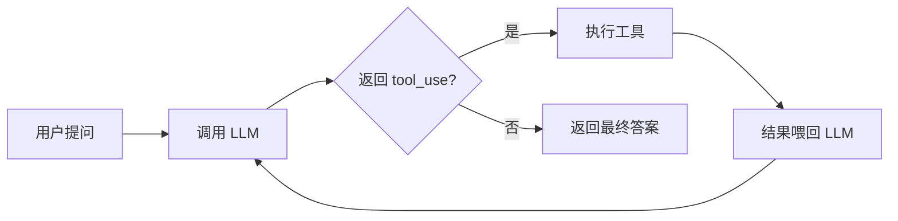

**一句话**：LLM 不是"一次回答"，而是可以反复调用、根据工具结果做下一步决策的循环引擎。

---

#### s02 工具系统

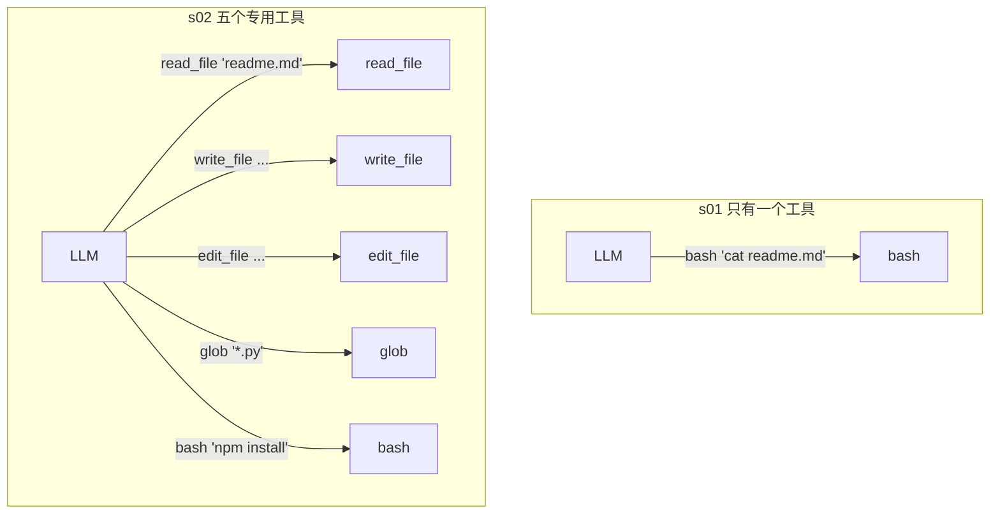

**一句话**：把"用 bash 模拟一切"升级为"每种操作有专用工具"，降低 LLM 犯错概率，减少 token 浪费。

---

#### s03 权限系统

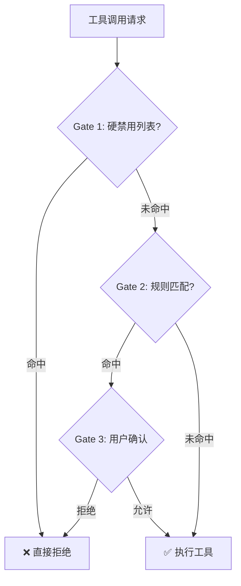

**一句话**：安全不能靠信任 LLM，要在代码层面加三道闸门——最危险的操作直接拦，有风险的操作请用户确认。

---

#### s04 Hooks 钩子系统

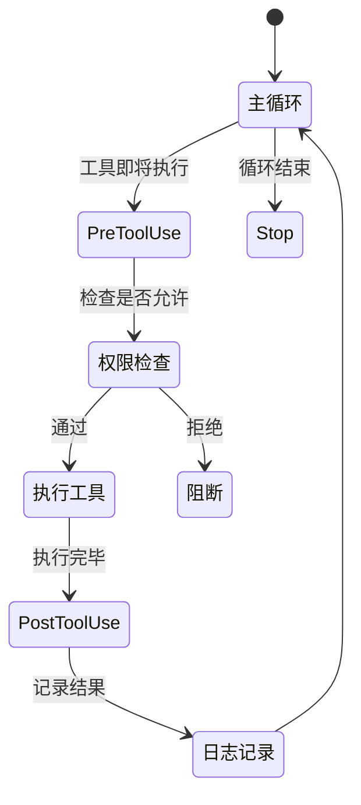

**一句话**：把"在循环里加 if 判断"变成"注册一个回调"，主循环保持干净，新功能不碰核心代码。

---

#### s05 TodoWrite 计划管理

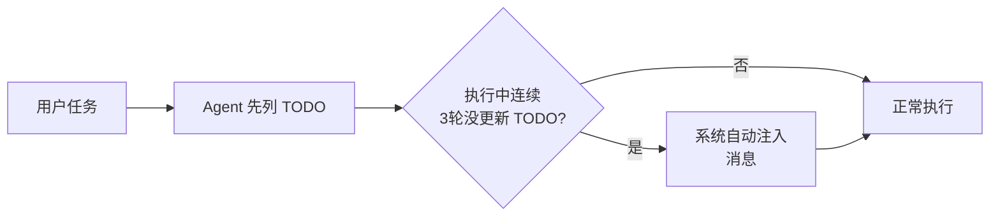

**一句话**：LLM 容易"边做边忘"，todo_write 强制它先列清单再动手，nag 机制防止它偷懒不更新进度。

---

#### s06 子智能体

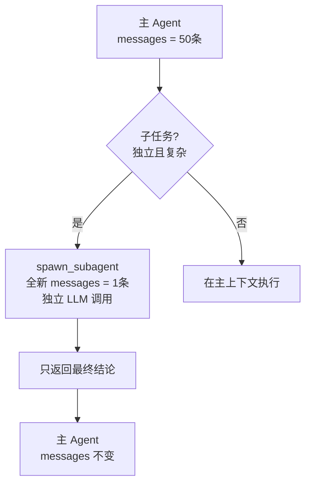

**一句话**：复杂子任务交给子 Agent 独立处理，中间过程不污染主 Agent 的上下文，主 Agent 只看到结论。

---

#### s07 渐进式 Skill 加载

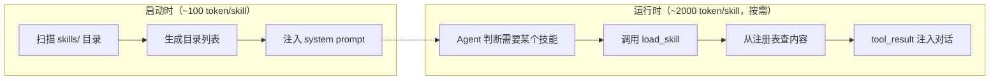

**一句话**：技能文档不该每次都带在身上，启动时只带"目录"，用的时候再加载"正文"，节省 69% token。

---

#### s08 上下文压缩

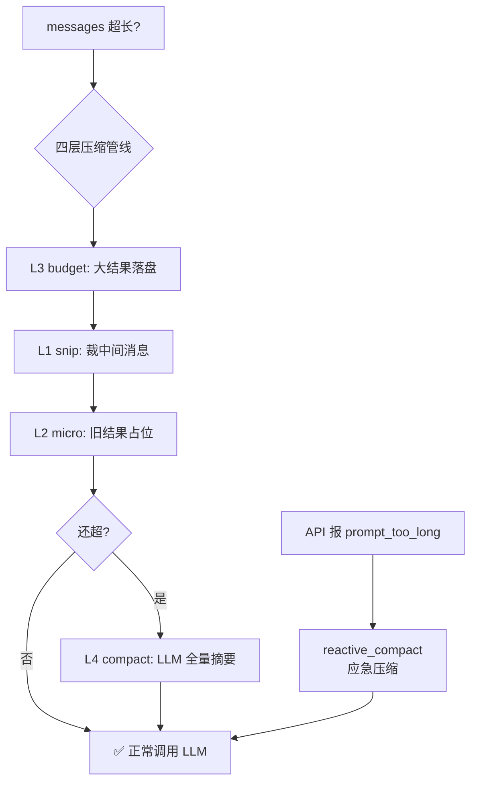

**一句话**：对话历史不可能无限增长，便宜的文本操作先跑，实在不行才花 API 钱做 LLM 摘要。

---

#### s09 记忆系统


**一句话**：压缩会丢信息，但记忆系统不受压缩影响——用户偏好和项目知识跨压缩、跨会话保留。

---

#### s10 运行时提示词组装

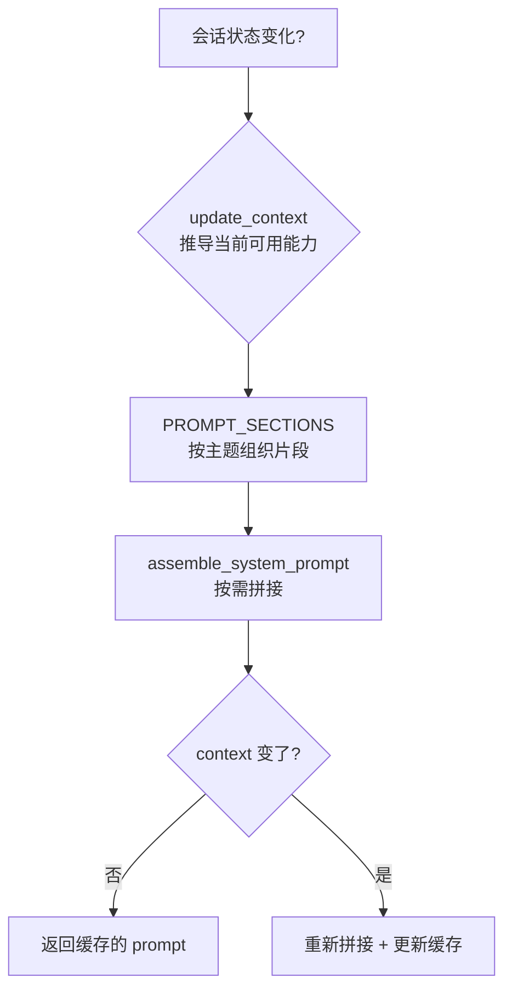

**一句话**：system prompt 不是写死的字符串，而是根据当前会话状态动态组装的配置，省 token又灵活。

---

#### s11 错误恢复

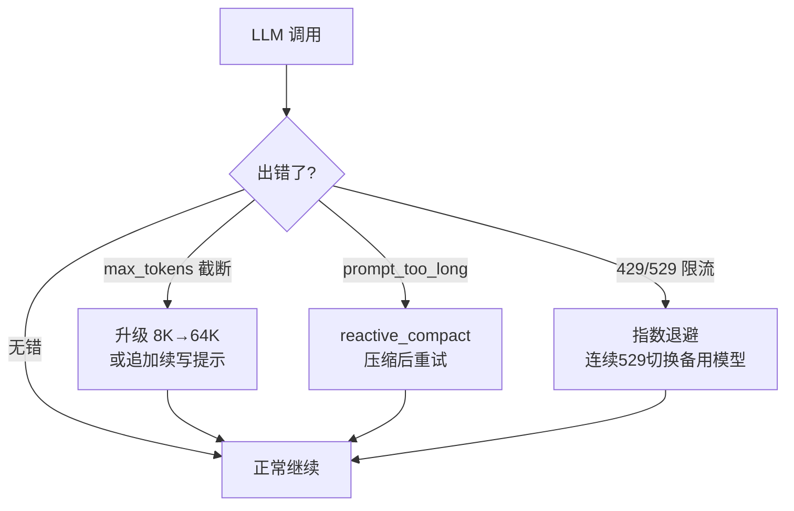

**一句话**：API 报错不是终点，分三类错误三种恢复方式——扩容、压缩、退避重试，让 Agent 在故障中继续工作。

---

#### s12 任务图系统

```mermaid
flowchart LR
    A[create_task "建数据库"] --> B[.tasks/\ntask_001.json]
    C[create_task "写API"\nblockedBy: task_001] --> D[.tasks/\ntask_002.json]
    B --> E[complete_task task_001]
    E --> F[can_start task_002? ✅]
    F --> G[claim_task task_002]
```

**一句话**：TodoWrite 存在内存里，会话结束就没了。任务图存在磁盘上，有依赖关系，可以跨会话恢复，是多 Agent 协作的基础。

---

#### s13 后台任务

```mermaid
flowchart TD
    A[LLM 调用 bash "pip install torch"] --> B{should_run_background?}
    B -->|是| C[启动 daemon 线程执行]
    B -->|否| D[主循环等待结果]
    C --> E[立即返回占位结果\n"[后台任务已启动]"]
    E --> F[主循环继续处理其他请求]
    C --> G[完成后发送\n<task_notification>]
    G --> H[下一轮 LLM 看到结果]
```

**一句话**：耗时操作（安装、构建、测试）扔后台，主循环不傻等，LLM 按 token 计费的时间不能浪费在干等上。

---

#### s14 定时调度

```mermaid
flowchart TD
    A[注册 cron 任务\n"每天 9:00 跑测试"] --> B[守护线程\n每秒轮询]
    B --> C{时间到了?}
    C -->|是| D[推入 cron_queue]
    C -->|否| B
    D --> E[Agent 空闲时\n消费队列]
    E --> F[注入消息到上下文]
```

**一句话**：让 Agent 能"被定时唤醒"做周期性任务——不需要人盯着，到点自动触发。

---

#### s15 智能体团队

```mermaid
flowchart TD
    A[Lead Agent] --> B[spawn_teammate\n"alice, 后端开发"]
    A --> C[spawn_teammate\n"bob, 前端开发"]
    B --> D[alice 线程\n独立 system prompt + messages]
    C --> E[bob 线程\n独立 system prompt + messages]
    D --> F[完成工作后\n发消息到 Lead 收件箱]
    E --> G[完成工作后\n发消息到 Lead 收件箱]
    F --> H[Lead inbox 注入 history]
    G --> H
```

**一句话**：子 Agent 是临时工，队友是常驻员工。用文件收件箱（.jsonl）实现异步通信，Lead 能看到所有队友的汇报。

---

#### s16 团队协议

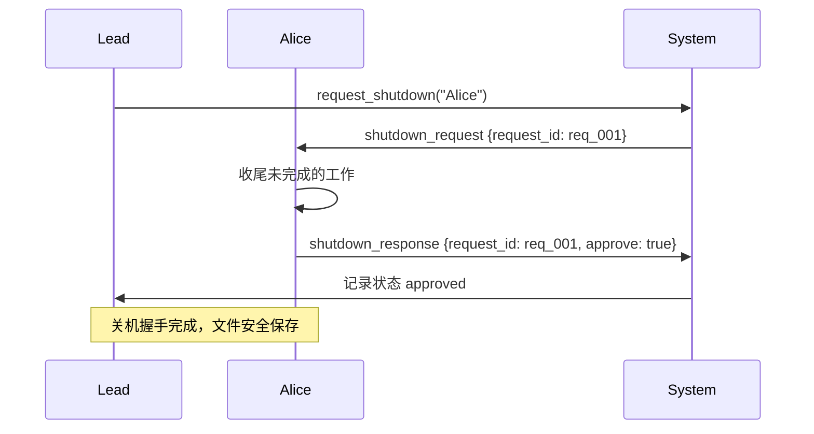

**一句话**：不能直接杀线程，要用 request_id 关联的请求-响应协议保证体面关机，防止写到一半的文件丢失。

---

#### s17 自主智能体

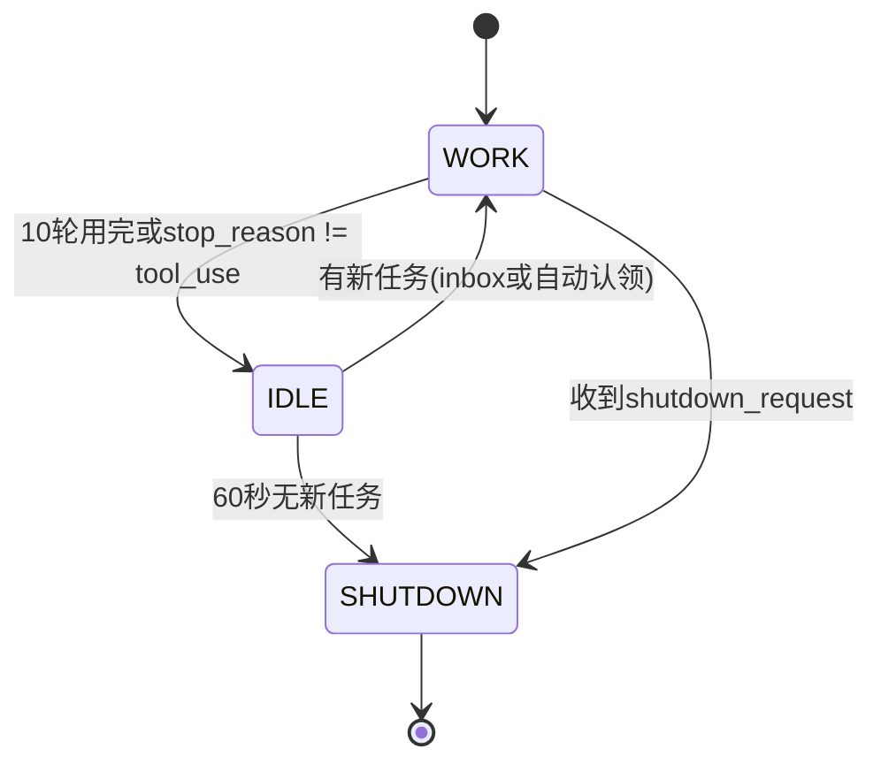

**一句话**：队友不用 Lead 盯着分配任务，自己每 5 秒看一次 inbox 和任务板，有活就干，没活等 60 秒再走。

---

#### s18 Worktree 隔离

```mermaid
flowchart TD
    A[create_worktree "feat-auth"] --> B[git worktree add\n.worktrees/feat-auth/\n分支 wt/feat-auth]
    C[create_worktree "feat-ui"] --> D[git worktree add\n.worktrees/feat-ui/\n分支 wt/feat-ui]
    B --> E[Alice 认领任务\ncwd 自动切到 .worktrees/feat-auth/]
    D --> F[Bob 认领任务\ncwd 自动切到 .worktrees/feat-ui/]
    E --> G[Alice 改 config.py\n→ 只影响 auth 分支]
    F --> H[Bob 改 config.py\n→ 只影响 ui 分支]
    G --> I[互不干扰，可独立 diff/log]
    H --> I
```

**一句话**：多 Agent 共享同一目录会互相覆盖文件，git worktree 让每个任务有独立目录和分支，改完可以独立 review 和合并。

---

#### s19 MCP 插件

```mermaid
flowchart LR
    A[内置工具\nbash/read/write...] --> C[统一工具池]
    D[connect_mcp "jira"] --> E[MCPClient\n发现工具列表]
    E --> F[mcp__jira__search_issue]
    G[connect_mcp "deploy"] --> H[MCPClient\n发现工具列表]
    H --> I[mcp__deploy__trigger_deploy]
    F --> C
    I --> C
```

**一句话**：外部服务（Jira、部署系统）只要实现 MCP 协议，Agent 就能直接用，不需要为每个服务手写工具代码。

---

#### s20 综合智能体

```mermaid
flowchart TD
    A[用户输入] --> B[UserPromptSubmit hook]
    B --> C[注入 cron/后台通知]
    C --> D[prepare_context\n四层压缩]
    D --> E[assemble_system_prompt\n动态组装]
    E --> F[with_retry LLM 调用]
    F --> G{stop_reason?}
    G -->|tool_use| H[PreToolUse hook\n权限检查]
    G -->|end_turn| I[Stop hook]
    H --> J[分发到内置/MCP/后台]
    J --> K[PostToolUse hook\n日志记录]
    K --> L[结果追加 messages]
    L --> D
    I --> M[返回最终答案]
```

**一句话**：前19章各自独立，s20 把所有机制组装进同一个循环——机制很多，循环一个。

---

### 章节分层总结

```mermaid
graph TB
    subgraph 横向维度["横向：Agent 需要什么能力？"]
        direction LR
        A1["执行能力<br/>s01-s02"] --> A2["安全能力<br/>s03-s04"] --> A3["规划能力<br/>s05-s06"] --> A4["记忆能力<br/>s07-s09"]
        A4 --> A5["韧性能力<br/>s10-s11"] --> A6["任务能力<br/>s12-s14"] --> A7["协作能力<br/>s15-s18"] --> A8["扩展能力<br/>s19-s20"]
    end

    subgraph 纵向维度["纵向：每一章在循环上叠加什么？"]
        B1["s01 循环骨架"] --> B2["s02 工具注册表"] --> B3["s03 权限闸门"]
        B3 --> B4["s04 Hook 事件"] --> B5["s05 Todo 状态"]
        B5 --> B6["s06 子 Agent 隔离"] --> B7["s07 技能注册表"]
        B7 --> B8["s08 压缩管线"] --> B9["s09 记忆文件"]
        B9 --> B10["s10 提示词组装"] --> B11["s11 错误恢复"]
        B11 --> B12["s12 任务图"] --> B13["s13 后台线程"]
        B13 --> B14["s14 定时调度"] --> B15["s15 消息总线"]
        B15 --> B16["s16 协议状态机"] --> B17["s17 自动认领"]
        B17 --> B18["s18 Worktree 隔离"] --> B19["s19 MCP 插件"]
        B19 --> B20["s20 全部整合"]
    end
```

---

## 目录

- [一、项目已实现功能相关问题](#一项目已实现功能相关问题)
- [二、真实应用场景相关问题](#二真实应用场景相关问题)
- [三、简历描述引申问题](#三简历描述引申问题)
- [四、意外场景题：执行期间的失败与恢复](#四意外场景题执行期间的失败与恢复)
- [五、技术栈与技术选型](#五技术栈与技术选型)

---

## 一、项目已实现功能相关问题

### 1.1 Agent 核心循环

**Q：请描述 Agent 的核心循环是什么，以及它如何与 LLM 交互？**

```
用户输入
    ↓
[while stop_reason == "tool_use"]
    ↓
┌──────────────────────────────────────────────┐
│  1. 调用 LLM（携带 messages + tools + system） │
│        ↓                                     │
│  LLM 返回：stop_reason + tool_use blocks      │
└──────────────────────────────────────────────┘
    ↓
┌──────────────────────────────────────────────┐
│  2. 执行工具（根据 tool_use name 分发到处理函数）│
│        ↓                                     │
│  获取 tool_result                            │
└──────────────────────────────────────────────┘
    ↓
┌──────────────────────────────────────────────┘
│  3. 将 assistant(message + tool_use + tool_result)  │
│     追加到 messages 列表                          │
└──────────────────────────────────────────────┘
    ↓
loop 继续（stop_reason != "tool_use" 时退出）
    ↓
返回最终文本结果
```

**回答：**

Agent 的核心循环是一个"思考-行动-观察"的迭代过程，本质上是 while 循环，循环条件是 LLM 返回的 `stop_reason == "tool_use"`。具体流程如下：

1. **调用 LLM**：将当前的消息历史（messages）、可用的工具列表（tools）以及系统提示词（system）发送给 LLM。LLM 会返回两部分内容：`stop_reason`（判断是否继续循环）和 `tool_use` blocks（需要执行的工具调用列表）。
2. **执行工具**：根据 `tool_use` 中的 `name` 字段，从工具注册表（TOOL\_HANDLERS）中查找对应的处理函数，传入 `input` 参数执行，得到 `tool_result`。
3. **更新历史**：将 LLM 的回复（assistant message）和工具的执行结果（tool\_result）一起追加到 messages 列表中，作为下一轮对话的上下文。
4. **循环判断**：如果 `stop_reason` 不是 `"tool_use"`（通常是 `"end_turn"`），说明 LLM 已经给出了最终文本答案，退出循环，返回结果。

这个设计的关键在于：**LLM 不是一个一次调用的黑盒，而是一个可以多次交互的决策引擎**。每次循环，LLM 都能看到上一次工具执行的结果，从而做出下一步决策。对于简单任务可能只循环一次，对于复杂任务可能循环十几次。

***

**Q：工具系统是如何分发的？**

```
LLM 返回 tool_use block
    ↓
提取 block.name 和 block.input
    ↓
TOOL_HANDLERS[block.name](block.input)
    ↓
字典路由 → 对应处理函数
    ├─ bash → 执行 shell 命令
    ├─ read_file → 读取文件内容
    ├─ write_file → 写入文件
    ├─ edit_file → 精确编辑
    └─ glob → 文件模式匹配
    ↓
返回 ToolResult（stdout/stderr）
```

**回答：**

工具分发采用字典路由（Dictionary Dispatch）模式。所有工具的处理函数注册在一个名为 `TOOL_HANDLERS` 的字典中，key 是工具名称（字符串），value 是对应的处理函数。当 LLM 返回 `tool_use` block 时，提取其中的 `name` 和 `input`，直接通过 `TOOL_HANDLERS[block.name](block.input)` 调用对应的处理函数。

这种设计的优点是扩展性极好——新增一个工具只需要两步：在字典中注册一个 entry，实现对应的处理函数。不需要修改主循环的任何代码。所有工具都在 WORKDIR 沙箱内执行，配合路径安全检查（safe\_path），防止路径穿越攻击。

***

### 1.2 权限系统

**Q：权限系统是如何设计的？有哪些层级的检查？**

```
工具执行前
    ↓
[检查权限]
    ↓
┌──────────────────────────────────────┐
│ Gate 1：硬禁用列表                    │
│ 检查是否包含：rm -rf /, sudo, shutdown│
│ → 命中则直接拒绝                     │
└──────────────────────────────────────┘
    ↓ 未命中
┌──────────────────────────────────────┐
│ Gate 2：规则匹配                      │
│ 检查：写操作是否超出 WORKDIR           │
│ 检查：是否为破坏性命令                 │
│ → 命中则要求审批                     │
└──────────────────────────────────────┘
    ↓ 未命中
┌──────────────────────────────────────┐
│ Gate 3：用户确认                      │
│ 交互式询问 y/N                       │
│ → 用户拒绝则中止执行                  │
└──────────────────────────────────────┘
    ↓ 用户确认
执行工具
```

**回答：**

权限系统采用三层门控设计，从严格到宽松逐层过滤：

- **第一层（硬禁用）**：维护一个危险命令黑名单（如 `rm -rf /`、`sudo`、`shutdown` 等），命中则直接拒绝，不需要用户确认。这是安全底线。
- **第二层（规则匹配）**：检查写操作是否超出工作目录（WORKDIR），以及是否为破坏性命令（如删除文件、修改系统配置）。命中则进入下一层审批流程。
- **第三层（用户确认）**：对于通过前两层但仍有风险的操作，弹出交互式确认（y/N），由用户决定是否允许执行。

这三层是递进关系：第一层最严格，直接拦截；第二层做范围约束；第三层把决策权交给用户。任何一层拦截都会阻断工具执行。在实际代码中，这个权限检查被封装为一个 Hook（PreToolUse 事件），通过 s04 的钩子系统触发，无需修改主循环逻辑。

***

### 1.3 Hooks 钩子系统

**Q：为什么引入 Hooks 系统？它解决了什么问题？**

```
设计问题：权限检查逻辑耦合在 agent_loop 主循环中
    ↓
解决方案：事件驱动 Hook 系统
    ↓
定义事件类型：
  UserPromptSubmit → 用户提交 prompt 时
  PreToolUse       → 工具执行前
  PostToolUse      → 工具执行后
  Stop             → 循环结束时
    ↓
注册机制：
  register_hook(event, callback) → 回调链
    ↓
触发机制：
  trigger_hooks(event, *args)
    ↓
任一回调返回非 None → 中断后续执行
（如权限检查返回 False 则阻断工具调用）
```

**回答：**

在早期版本中，权限检查、日志记录等扩展逻辑直接写在 agent\_loop 主循环里，导致主循环代码越来越臃肿，每次新增功能都要修改核心循环。Hooks 系统将这类"横切关注点"（cross-cutting concerns）从主循环中抽离出来，采用事件驱动的方式实现。

核心思想是：定义一组生命周期事件（如"工具执行前"、"工具执行后"、"循环结束"），任何功能模块都可以注册自己的回调函数到对应事件上。当事件触发时，按注册顺序依次调用所有回调。如果某个回调返回非 None 值（如权限检查返回 False），则中断后续执行。

这样主循环只负责触发事件，各功能模块各自注册钩子，互不干扰。新增权限检查、日志记录、监控等功能时，只需注册一个新的 hook，不需要修改主循环代码。这是一个典型的**开闭原则**实践——对扩展开放，对修改关闭。

***

### 1.4 TodoWrite 计划管理

**Q：TodoWrite 工具的作用是什么？Nag 机制是如何工作的？**

```
工具调用：todo_write(todos)
    ↓
更新全局 CURRENT_TODOS 列表
    ↓
每次 Agent 轮次结束时检查 nag 计数器
    ↓
如果连续 3 轮未调用 todo_write 更新状态
    ↓
自动注入 <reminder> 消息到 messages
    ↓
提醒 LLM 先规划再执行
```

**回答：**

TodoWrite 工具的核心目的是引导 LLM 在执行多步任务前先进行规划。很多情况下，LLM 接到任务后会立即开始执行，而没有先梳理整体步骤，容易导致遗漏或重复工作。

`todo_write` 工具让 LLM 显式地列出任务清单（每个任务的描述和状态），保存在全局 `CURRENT_TODOS` 中。LLM 在每步执行前/后可以更新这个清单，保持对整体进度的感知。

Nag（催促）机制是一个防呆设计：如果 LLM 连续 3 轮都没有调用 `todo_write` 更新任务状态，系统会自动在 messages 中注入一条 `<reminder>` 消息，提醒 LLM 先规划再执行。这类似于人类工作中"先列 TODO 再动手"的习惯培养。

***

### 1.5 子智能体

**Q：子智能体和普通工具调用有什么区别？**

```
普通工具调用：
  Lead Agent 调用工具 → 执行 → 返回结果 → Lead 继续
  共享同一 messages 上下文

子智能体（spawn_subagent）：
  Lead Agent 描述子任务
    ↓
  创建全新 messages = [{"role": "user", "content": description}]
    ↓
  独立调用 LLM（最多 30 轮）
  使用 SUB_TOOLS（无 task 工具，防止递归派生）
    ↓
  只返回最终文本摘要
  中间过程全部丢弃
    ↓
  结果以工具形式返回给 Lead
```

**回答：**

子智能体和普通工具调用的核心区别在于**上下文隔离**和**独立性**：

- 普通工具调用完全在 Lead Agent 的上下文内执行，工具结果直接回到 Lead 的 messages 列表。Lead 看到工具执行的完整过程。
- 子智能体是一个完全独立的 Agent 实例，拥有自己的 messages 列表（从头开始，只包含子任务描述）、自己的 LLM 调用轮次（上限 30 轮）、自己的工具集（去掉了 task 相关工具，防止无限递归派生）。子智能体执行过程中的所有中间状态都不回传给 Lead，只有最终的文本摘要返回。

这种设计的价值在于：**子任务不需要占用 Lead 的上下文空间**。当 Lead 需要处理一个复杂子任务时，可以把整个子任务委托给子智能体，自己继续处理其他事情。子智能体的中间过程（多次 LLM 调用、工具执行）完全在后台完成，Lead 只看到最终结果。

***

### 1.6 渐进式 Skill 加载

**Q：为什么需要两级加载？为什么不直接把所有技能内容放入 system prompt？**

```
问题：将所有技能文档（~6500行）塞入 system prompt
  → 每轮 LLM 调用都携带，99%内容与当前任务无关
  → 浪费 token，增加延迟和成本

两级加载设计：

┌─ 第一级：启动时 ──────────────────────┐
│ 扫描 skills/ 目录                     │
│ 解析每个 SKILL.md 的 YAML frontmatter  │
│ 生成目录列表（~100 tokens/skill）      │
│ 注入 SYSTEM prompt                     │
│ → Agent 每轮都能看到"有哪些技能可用"    │
└────────────────────────────────────────┘
              ↓
┌─ 冬二级：运行时 ──────────────────────┐
│ Agent 调用 load_skill("skill-name")   │
│ 通过 SKILL_REGISTRY 查找（防路径穿越）  │
│ SKILL.md 完整内容通过 tool_result 注入 │
│ → 按需加载，约 2000 tokens/skill       │
└────────────────────────────────────────┘
```

**效果：节省约 69% system prompt token**

**回答：**

如果把所有技能文档一次性塞入 system prompt，会带来两个核心问题：

1. **Token 浪费**：假设项目有 10 个技能，每个 SKILL.md 约 2000 tokens，总共 20,000 tokens。但一个典型会话可能只用其中 1-2 个技能，其余 80% 的内容每轮 LLM 调用都要携带，却完全不参与推理。
2. **干扰决策**：过多的无关上下文会稀释关键信息，降低模型对当前任务的专注度。

两级加载的解决方案：第一级（启动时）只扫描每个技能的元数据（名称 + 描述，约 100 tokens/技能），注入 system prompt 让 Agent 知道"有什么技能可用"；第二级（运行时）当 Agent 判断需要某个技能时，调用 `load_skill` 工具，将该技能的完整内容通过 tool\_result 注入到当前对话上下文中。

实际效果：假设 10 个技能中只用 3 个，一次性加载的开销是 20,000 tokens，两级加载的开销是 1,000（目录）+ 6,000（3 个技能内容）= 7,000 tokens，节省约 65%。在实际测试中，典型场景的节省比例约为 69%。

---

### 工具调用关系约束

**Q：项目是如何约束工具之间的调用关系的？如何确保正确的调用顺序？什么情况下工具可以并行执行？**

```
┌──────────────────────────────────────────────────────────────┐
│              工具调用约束的三层机制                           │
├──────────────────────────────────────────────────────────────┤
│  第 1 层：System Prompt 原则（指导 LLM 决策）                 │
│  ├─ 专用工具优先：read_file 优于 cat，glob 优于 find          │
│  ├─ bash 是最后手段                                           │
│  ├─ read before write：写前先读                              │
│  ├─ edit_file 唯一性：old_text 必须唯一                      │
│  └─ 并行调用：独立操作合并为一次消息                          │
├──────────────────────────────────────────────────────────────┤
│  第 2 层：Permission Hook（执行前校验）                       │
│  ├─ 路径安全：safe_path() 拒绝 WORKDIR 外路径                │
│  ├─ 硬禁用列表：rm -rf /、sudo 等直接拦截                     │
│  ├─ 规则匹配：> /etc/、chmod 777 等触发用户确认               │
│  └─ MCP 工具：含 deploy 等危险关键词触发审批                  │
├──────────────────────────────────────────────────────────────┤
│  第 3 层：执行引擎（控制并发与顺序）                          │
│  ├─ 同 turn 内：按原始顺序逐个执行（教学版）                  │
│  ├─ 依赖检查：can_start() 防止依赖未完成的任务被认领           │
│  └─ 后台任务：耗时操作异步执行，不阻塞主循环                  │
└──────────────────────────────────────────────────────────────┘
```

#### 确保正确调用顺序的方式

调用顺序的约束不是靠硬性代码强制执行，而是通过 **LLM 指令 + 工具语义 + 上下文传递** 三者结合实现的：

```
方式 1：System Prompt 原则（显式指令）
  System Prompt 中写入 10 条工具使用原则：
    "4. READ BEFORE OVERWRITE: before write_file overwrites
       an existing file, call read_file first"
    "5. EDIT UNIQUENESS: edit_file requires old_text to be unique"
    "8. DIAGNOSTICS AFTER EDIT: after editing .py files,
       call diagnostics to verify before declaring done"
  → LLM 在生成 tool_use 时会遵守这些指令

方式 2：工具语义约束（隐式保障）
  edit_file 内部实现要求 old_text 必须在文件中存在：
    if old_text not in text:
        return f"Error: text not found in {path}"
  → 即使 LLM 顺序错了，工具也会返回错误，LLM 从结果中学习

方式 3：上下文传递（顺序依赖的自然保证）
  工具按 LLM 返回的顺序逐个执行，每次执行后结果追加到 messages
  → 后续工具调用能看到前面工具的结果
  → 如果 A 的输出是 B 的输入，LLM 必须先把 A 的结果看到
    才能正确调用 B（因为 B 的 input 需要引用 A 的输出）
```

**典型场景举例：正确顺序 vs 错误顺序**

```
场景 A：写一个新文件（read → write）
  正确顺序：
    ① read_file("config.py") → 发现文件不存在（Error: File not found）
    ② write_file("config.py", content) → 创建文件
    ↓
    LLM 看到"File not found"后，知道需要创建而非覆盖

  错误顺序（LLM 未遵守原则 4）：
    ① write_file("config.py", content) → 覆盖已有内容（静默成功）
    ② read_file("config.py") → 读到被覆盖后的内容
    ↓
    问题：原有配置丢失，且 LLM 无法察觉
    防护：Permission Hook 对 write_file 触发用户确认（如果是生产版）

场景 B：修改文件中的某一行（read → edit → verify）
  正确顺序（遵循原则 5 + 8）：
    ① read_file("app.py") → 确认当前内容
    ② edit_file("app.py", old_text, new_text) → 精确替换
    ③ diagnostics("app.py") → 验证 Python 语法正确
    ↓
    每个步骤的结果都在 messages 中，LLM 可以看到

  错误顺序（LLM 跳过了 read）：
    ① edit_file("app.py", old_text, new_text) → old_text 不存在
       → 返回 "Error: text not found in app.py"
    ② LLM 从错误消息中得知需要先读取文件
    ↓
    工具的返回错误本身就是二次约束——LLM 学会从失败中学习

场景 C：创建任务并启动执行（create → claim → complete）
  正确顺序（任务系统 DAG 约束）：
    ① create_task("setup db") → 返回 task_id="task_abc123"
    ② claim_task("task_abc123") → 状态变为 in_progress
    ③ 执行数据库初始化工作
    ④ complete_task("task_abc123") → 状态变为 completed，解锁下游

  错误顺序（LLM 跳过了 claim）：
    ① create_task("setup db") → 任务 pending
    ② complete_task("task_abc123") → 检查 can_start？
       → 不需要 can_start（complete 不需要前置条件）
       → 但任务状态从 pending 直接跳到 completed？
       → 实际上 complete_task 只改 status，不检查 owner
    ↓
    问题：没有 owner 的任务被标记为完成，任务图状态不一致
    防护：在 system prompt 中明确要求"先 claim 再 complete"
```

---

**Q：什么情况下工具可以并行执行？什么情况下必须串行？**

```
并行执行的判定标准：两个工具调用是否满足
  ① 无数据依赖（A 的输出不是 B 的输入）
  ② 无资源冲突（不写同一个文件）
  ③ 无顺序约束（A 和 B 的执行顺序不影响结果）

并行安全的工具组合：
  read_file("a.py") + read_file("b.py")      ✓ 读读不冲突
  glob("*.py") + ls(".")                      ✓ 两个读操作
  read_file("a.py") + grep("TODO", "b.py")   ✓ 读+读（grep 也只读）
  bash("echo hello") + bash("date")          ✓ 两个独立命令

必须串行的工具组合：
  write_file("config.py", ...) → edit_file("config.py", ...)
    ✗ 写后编辑：编辑的 old_text 依赖于写的内容
  read_file("schema.sql") → create_task(..., blockedBy=[...])
    ✗ 读后创建：创建任务时需要引用读到的内容
  edit_file("app.py", ...) → diagnostics("app.py")
    ✗ 编辑后诊断：diagnostics 需要看到编辑后的文件
  claim_task(id) → complete_task(id)
    ✗ 任务状态机：必须先 claim 才能 complete

生产级 Claude Code 的并行优化：
  CC 不只靠 LLM 判断，还在执行引擎层面做分析：
  isConcurrencySafe(tool_name, input) → 判断单个调用是否安全并发
  partitionToolCalls(calls) → 将 calls 切分为多个 batch：
    [read a, read b, glob *.py, bash "rm x", read c]
      → batch1(并发): [read a, read b, glob *.py]
      → batch2(串行): [bash "rm x"]
      → batch3(并发): [read c]
  batch 内真正并发执行，batch 间严格顺序
  教学版简化为"按原始顺序逐个执行"，不区分并发/串行
```

---

**Q：教学版和生产版在并行执行工具方面的主要区别是什么？**

```
教学版（s20_comprehensive）：
  执行方式：for block in response.content（逐个顺序执行）
  并发控制：无（教学场景不需要）
  优点：代码简单，易于理解
  缺点：相同 turn 内的多个独立读操作也需要串行，浪费时间

生产版（Claude Code）：
  执行方式：partitionToolCalls() 智能分区
  并发控制：isConcurrencySafe() + batch 分组
  优点：独立的读操作可以并行，显著减少 wall-clock 时间
  缺点：实现复杂度高，需要分析工具间的依赖关系

关键差异总结：
  教学版：一次 turn 内的所有工具调用按原始顺序逐个执行
  生产版：一次 turn 内的工具调用按依赖关系分 batch，
         同 batch 内并发执行，不同 batch 间串行执行
  本质：教学版牺牲性能换取清晰度，生产版在清晰度的基础上
        增加了执行效率优化
```

---

### 1.7 四层上下文压缩

**Q：请详细说明四层压缩管线的顺序和各层的作用。**

```
每轮 LLM 调用前的压缩管线（便宜→昂贵）：

[步骤 1] tool_result_budget（L3）
  统计最后一条 user 消息中所有 tool_result 总大小
    ↓
  超过 200KB → 按大小降序排列
    ↓
  从最大的开始持久化到磁盘（.task_outputs/tool-results/）
    ↓
  上下文只保留 <persisted-output> 标记 + 前 2000 字符预览
  → 0 API 调用

[步骤 2] snip_compact（L1）
  消息数 > 50 → 保留头部 3 条 + 尾部 47 条
    ↓
  中间部分裁剪，插入占位符
  → 保护 tool_use/tool_result 配对不被拆开
  → 0 API 调用

[步骤 3] micro_compact（L2）
  旧的工具结果（保留最近 3 条）→ 替换为一行占位符
    ↓
  "[Earlier tool result compacted. Re-run if needed.]"
  → 0 API 调用

[步骤 4] compact_history（L4）
  若上述三层后 token 仍超阈值
    ↓
  保存完整 transcript 到 .transcripts/
    ↓
  调用 LLM 生成摘要（当前目标、重要发现、已改文件、剩余工作）
    ↓
  用摘要替换整个消息列表
  → 1 API 调用（最昂贵）

应急：reactive_compact
  API 返回 prompt_too_long 时触发
  比 compact_history 更激进（从尾部回退）
  最多重试 1 次
```

**关键设计原则：便宜的先跑，贵的后跑**

**回答：**

上下文压缩的核心挑战是：Agent 运行时间越长，messages 列表越长，最终会超出模型的上下文窗口限制（prompt\_too\_long 错误）。解决方案是分四层渐进式压缩，从低成本到高成本依次执行：

- **L3 tool\_result\_budget（最优先）**：只处理数据量最大的 tool\_result，将其完整内容保存到磁盘，上下文中只留标记和预览。纯文本操作，零 API 成本，但能解决大部分空间问题（一个大文件的输出可能占上下文 30%+）。
- **L1 snip\_compact**：裁剪中间的旧消息，保留头部（初始意图）和尾部（当前工作）。同样是纯文本操作，零 API 成本。
- **L2 micro\_compact**：将旧的工具结果替换为占位符，只保留最近几条的完整内容。零 API 成本。
- **L4 compact\_history（最后手段）**：调用 LLM 对整段历史生成摘要，用一段文字替换所有旧消息。这是唯一消耗 API 成本的一层，所以放在最后。

应急的 reactive\_compact 是在上述四层都没能阻止 prompt\_too\_long 错误时触发的最后一招，比 L4 更激进。

四层的设计哲学是：**能用文本操作解决的绝不调 LLM**，因为文本操作是免费的，而 LLM 摘要每次都要花钱。

***

**Q：为什么 L3（tool\_result\_budget）必须在 L2（micro\_compact）之前执行？**

```
原因：micro_compact 会把旧的大 tool_result 替换成一行占位符
  如果先执行 micro_compact，大内容的完整信息就丢失了
  → budget 必须在其前面，先把完整内容落盘到磁盘

正确顺序：budget → snip → micro → auto
  这与 Claude Code 源码中的实际顺序一致
```

**回答：**

这是一个关键的设计细节。micro\_compact 的工作方式是把旧的工具结果整块替换成一行占位符文本（如"\[Earlier tool result compacted. Re-run if needed.]"）。如果先执行 micro\_compact，那些原本很大的 tool\_result 内容就彻底从上下文中消失了，只留下一行文字。

而 tool\_result\_budget 的作用是把这些大内容**持久化到磁盘**，保留完整的原始数据。如果 micro\_compact 先执行，budget 层就找不到这些大内容了——它们已经被占位符替换掉了。

所以顺序必须是：先把大内容安全地落盘（budget），然后再做占位替换（micro）。这个顺序也与 Claude Code 生产代码中的实际实现完全一致。

***

### 1.8 记忆系统

**Q：记忆系统有哪几种类型？它是如何与压缩管线协作的？**

```
记忆类型：
  user      → 用户偏好（如代码风格、命名规范）
  feedback  → 指导信息（如项目约束、架构决策）
  project   → 项目事实（如技术栈、目录结构）
  reference → 外部引用（如文档链接、API 参考）

存储结构：
  .memory/MEMORY.md  → 索引文件
  .memory/{type}_*.md → 独立记忆文件

与压缩管线的协作：
  压缩前 → 用 session memory 做轻量摘要（不调 LLM）
  压缩后 → 相关记忆重新注入到 context
  跨会话 → 记忆持久化到磁盘，不随压缩丢失
```

**回答：**

记忆系统解决了"压缩会丢信息"的问题。上下文压缩管线虽然能控制 token 数量，但压缩的本质是丢失——旧的对话内容被摘要或占位符替代。如果用户之前说过"我喜欢用 TypeScript 而不是 JavaScript"，压缩后这条偏好就丢了。

记忆系统提供了压缩之外的长期存储，分为四种类型：

- **user 记忆**：用户的个人偏好和习惯
- **feedback 记忆**：用户给出的指导和反馈
- **project 记忆**：项目的客观事实（技术栈、目录结构等）
- **reference 记忆**：外部参考链接和文档

记忆文件持久化到磁盘（`.memory/` 目录），不受压缩管线影响。每次压缩后，系统会从记忆库中选择与当前任务相关的记忆重新注入到上下文中。这样即使对话历史被压缩，重要的用户偏好和项目知识仍然保留。

***

### 1.9 运行时提示词组装

**Q：为什么需要动态组装 system prompt？缓存机制是如何工作的？**

**回答：**

静态 system prompt 的问题是"全量加载"——不管当前会话用不用得到某些功能，所有工具描述、技能说明、任务系统指引都会占据 context。假设我们注册了 20 个工具，但当前任务只需要其中 3 个，剩下 17 个工具的 Description 仍然每轮都携带，白白消耗 token。

动态组装的核心思路是：system prompt 不再是一成不变的字符串，而是根据当前会话的**实际状态**按需拼接的。`update_context()` 函数从真实状态推导——哪些工具已注册、记忆文件是否存在、任务系统是否启用、MCP 插件是否连接等——生成一个 context 字典。`assemble_system_prompt(context)` 根据这个字典只拼接实际需要的片段。

缓存机制很简单：以 context 字典的 JSON 序列化结果作为 key。只要会话状态没有变化（没有新工具注册、没有新记忆写入），就直接返回缓存的 prompt，避免重复拼接。这对性能很重要，因为 system prompt 每轮 LLM 调用都要携带。

***

### 1.10 错误恢复系统

**Q：错误恢复系统如何处理三种不同的错误类型？**

**回答：**

错误恢复系统针对三类典型错误设计了不同的处理策略：

1. **max\_tokens 截断**：模型输出被截断，说明输出不够完整。处理策略是阶梯式升级——第一次遇到时不重试，而是将 max\_tokens 升级到 64K 让模型重新生成；如果再次截断，则在消息中追加"请继续之前的输出"提示，最多重试 3 次。核心思路是：先尝试给更多空间，再尝试提示模型继续。
2. **prompt\_too\_long（413）**：输入上下文超出限制。处理策略是触发 reactive\_compact（应急压缩），裁剪掉一些旧消息后重试一次。如果仍然失败，说明压缩能力已达极限，交由上层的四层压缩管线在下一轮主动处理。
3. **429/529（速率限制/服务不可用）**：这是典型的 transient 错误，适合重试。采用指数退避加随机抖动（jitter）的策略，最多重试 10 次。特别地，如果连续 3 次都是 529 错误，说明当前模型可能有问题，自动切换到备用模型重试。

所有重试逻辑统一封装在 `with_retry()` 函数中，通过 `RecoveryState` 跟踪 escalations、compacts、529 计数等状态，确保不会无限重试。

***

### 1.11 任务图系统

**Q：任务系统的数据结构是什么？如何保证依赖关系的正确性？**

**回答：**

每个任务是一个 JSON 文件，包含以下核心字段：id（唯一标识）、subject（简短标题）、description（详细描述）、status（pending/in\_progress/completed）、owner（认领者）、blockedBy（依赖的任务 ID 列表）。

依赖关系的正确性通过 `can_start()` 函数保证：遍历 blockedBy 列表，检查每个依赖任务是否同时满足两个条件——任务文件存在（ID 有效）且状态为 completed。任一条件不满足则返回 False，任务被阻塞。

当 `complete_task()` 完成一个任务时，会主动扫描所有 pending 状态的任务，找出 blockedBy 全部 completed 的任务（即刚刚被解锁的下游任务），并将解锁信息返回给调用者。这样依赖链就能自动推进，不需要人工干预。

任务的生命周期是简单的状态机：pending → claim\_task → in\_progress → complete\_task → completed。没有反向路径（不能从 in\_progress 回到 pending），这避免了状态的混乱。

***

### 1.12 后台任务

**Q：后台任务是如何与主 Agent 循环协作的？**

**回答：**

后台任务解决的是"耗时操作阻塞主循环"的问题。LLM 按调用计费，如果在主循环中等待一个需要 5 分钟的 `npm install` 或 `pytest` 测试，不仅浪费时间，还浪费 LLM token（因为主循环在等待期间无法做其他决策）。

判断是否走后台的逻辑是：如果模型显式指定 `run_in_background=True`，或者工具调用中包含 install/build/test/deploy 等关键字，就启动一个 daemon 线程异步执行。主循环立即返回"任务已在后台运行"，继续处理其他请求。

后台线程完成任务后，通过 `background_lock` 线程安全地更新状态，然后以 `<task_notification>` XML 格式注入到消息流中。主循环在下一次迭代时看到通知，获取后台任务的结果并继续处理。这种方式让主循环保持活跃，同时不阻塞耗时操作。

***

### 1.13 定时调度器

**Q：定时调度器是如何实现的？如何保证持久化？**

**回答：**

定时调度器是一个独立的守护线程，每秒轮询一次当前时间，用 `cron_matches()` 函数匹配已注册的 CronJob 的 5 字段 cron 表达式。命中时将该任务推入 `cron_queue`。

主循环中有一个 `consume_cron_queue()` 函数持续消费队列，将触发的事件注入到 Agent 的上下文中。这相当于让 Agent 能够"被定时唤醒"去做某些事情，比如每天清理临时文件、定期运行测试等。

持久化通过 `.scheduled_tasks.json` 文件实现。支持 durable 标记：如果任务设置了 durable=True，则注册时会写入该文件；启动时从文件中加载所有 durable 任务，恢复调度状态。这样重启后定时任务不会丢失。

***

### 1.14 智能体团队（MessageBus）

**Q：MessageBus 为什么选择文件而非内存队列？通信流程是怎样的？**

**回答：**

选择文件作为消息总线有两方面原因：一是**可观察性**，`.jsonl` 文件可以直接用文本编辑器查看，调试时能看到每条消息的完整内容，这对于教学和排查问题非常有用；二是**跨进程共享**，不同线程或进程都能读写同一个文件，无需复杂的共享内存机制。

当然文件方案有缺点：I/O 延迟高，并发读写需要加锁，read+unlink 不是原子操作可能导致消息丢失。在教学场景下这些 trade-off 是可接受的。值得注意的是，生产级 Claude Code 同样使用文件收件箱（路径为 `~/.claude/teams/{team}/inboxes/`），只是在文件操作上加了 proper-lockfile 来保证并发安全。

通信流程很简单：发送方将 JSON 对象序列化为字符串追加（append）到目标收件箱文件；接收方读取整个文件内容，处理完所有消息后删除文件（消费式）。这种方式语义清晰，但确实存在并发读写的风险。

***

### 1.15 团队协议

**Q：请求-响应协议是如何保证请求和响应正确匹配的？**

**回答：**

核心机制是 `request_id` 关联键。每个请求创建时生成一个唯一 ID（如 `"req_004281"`），这个 ID 伴随请求消息一起发出，也记录在 `pending_requests` 字典的 ProtocolState 中。

当响应消息返回时，也携带同一个 `request_id`。`match_response()` 函数通过 `request_id` 查找对应的 ProtocolState，同时校验响应类型是否与请求类型匹配（如 shutdown\_response 只能匹配 shutdown 类型的请求），然后更新状态为 approved 或 rejected。

双重校验（request\_id + type）防止了两种错误：一是请求和响应张冠李戴（两个并发请求的响应混淆），二是不同类型请求的响应被错误处理。这类似于 HTTP 请求中的 correlation ID 机制。

***

### 1.16 自主智能体（WORK/IDLE 生命周期）

**Q：Teammate 的 WORK/IDLE 生命周期是如何工作的？**

**回答：**

Teammate 的生命周期分为三个阶段：WORK、IDLE、SHUTDOWN。

WORK 阶段是实际工作的阶段，内层循环最多执行 10 轮 LLM 调用。每轮检查 inbox 消息（可能有新指令或协议请求），然后正常调用 LLM 和执行工具。当 LLM 返回的 `stop_reason` 不是 `"tool_use"` 时，WORK 阶段结束。

IDLE 阶段是待命阶段，每 5 秒轮询一次，最长等待 60 秒。优先级是：先看 inbox 有没有新消息（特别是 shutdown\_request 必须立即响应），再看任务看板有没有可认领的任务（pending + 无 owner + 依赖已满足）。有工作就回到 WORK 阶段，60 秒内都没有工作则进入 SHUTDOWN。

这种设计让 Teammate 不是"用完即弃"的一次性角色，而是可以持续工作的"常驻员工"——做完当前任务后不会立即消失，而是等待下一个任务。60 秒超时是一种资源保护机制，防止空闲的 Agent 无限占用系统资源。

***

### 1.17 Git Worktree 隔离

**Q：为什么需要 Worktree 隔离？如何保证数据安全性？**

**回答：**

多 Agent 并行工作时，如果共享同一个工作目录，就会出现 Alice 和 Bob 同时修改同一个文件的情况——后者覆盖前者，且无法回溯是谁改的。Worktree 隔离让每个任务拥有独立的 git 工作目录和分支，从根本上避免了文件冲突。

安全措施有三层：

1. **名称校验**：worktree 名称只允许字母数字和下划线，防止路径穿越攻击。
2. **删除保护**：有未提交改动时默认拒绝删除，防止意外丢失工作成果。需要强制删除时必须显式传 `discard_changes=True`。
3. **事件日志**：每次 create/remove/keep 操作都写入 `.worktrees/events.jsonl`，形成可审计的操作历史。

队友认领带 worktree 的任务时，bash/read/write 工具的执行目录会自动切换到对应的 worktree 路径下，对模型来说完全透明——它以为自己还在原来目录下工作，实际上已经在隔离环境中了。

***

### 1.18 MCP 插件系统

**Q：MCP 插件系统是如何接入外部工具的？**

**回答：**

MCP（Model Context Protocol）是一种标准化的外部工具接入协议。MCPClient 类负责管理连接：`connect_mcp(name)` 连接到指定的 MCP 服务器，`discover_tools()` 从服务器获取工具定义列表（名称、描述、参数 schema），`assemble_tool_pool()` 将这些外部工具与内置工具合并为一个统一的工具池。

工具命名规范为 `mcp__{server}__{tool}`，通过 `normalize_mcp_name` 清理非法字符（如空格、特殊符号）。每次连接新的 MCP 服务器后，工具池会自动重建，Agent 无需重启就能使用新工具。

这种设计的价值在于**能力可扩展**：Agent 的核心能力（bash、read、write）是固定的，但通过 MCP 插件可以接入任意外部系统——Jira API、公司内部的部署平台、自定义的数据库查询工具等。Agent 不需要知道这些工具是谁写的，只需要知道它们的名称、描述和参数 schema。

***

### 1.19 模型池机制

**Q：模型池是如何实现自动切换的？什么情况下会触发切换？**

**回答：**

模型池机制解决的是单模型额度耗尽或不可用的问题。从环境变量 `MODEL_POOL` 加载一个模型列表（如 14 个 Qwen 系列模型），`ModelPool` 类维护这些模型的使用状态。

触发切换的条件是检测到配额耗尽错误。`is_quota_exhausted_error()` 函数识别多种错误类型：阿里云百炼的专属错误码 `AllocationQuota.FreeTierOnly`、通用的配额不足提示、余额不足提示等。一旦识别为配额耗尽，当前模型被标记为已耗尽，立即切换到下一个未耗尽的模型并重试（不计入重试次数）。

如果所有模型都耗尽，抛出 `AllModelsExhaustedError`，由 agent\_loop 捕获后打印红色的"无token"提示并优雅退出，而不是抛出未处理的异常。这保证了即使额度耗尽，系统也能给出清晰的提示而非崩溃。

***

## 二、真实应用场景相关问题

### 2.1 上下文管理

**Q：在实际项目中，四层压缩管线可能遇到哪些边界情况？如何优化？**

**回答：**

实际部署中会遇到几个典型的边界情况：

**情况一：单条 tool\_result 超大**。比如读取一个 10MB 的日志文件，即使 budget 层把内容落盘到磁盘，上下文中的预览部分（前 2000 字符）也不够模型理解文件内容。优化方案是可以增大 max\_bytes 阈值，或者实现分层保存策略——按文件大小分级处理，极大的文件不只保存预览，而是保存完整的元信息（行数、大小、摘要）。

**情况二：连续多次 compact\_history 失败**。熔断器设置为 3 次后停止重试，但此时上下文可能仍然过大。优化方案是增加降级策略——如果 LLM 摘要也失败，强制截断最早的消息（不带摘要），宁可丢失一些信息也不让系统崩溃。

**情况三：read\_file 被压缩后需要重新读取**。micro\_compact 把旧的 read\_file 结果替换为占位符后，模型需要重新调用 read\_file，多一次 API 调用。优化方案是维护 readFileState——记录上次读取的文件路径和时间，如果文件未变化则直接返回 FILE\_UNCHANGED\_STUB 而不是重新读取。

**情况四：压缩后丢失关键决策**。LLM 生成的摘要可能遗漏重要的中间决策。优化方案是在摘要 prompt 中明确要求保留决策路径，并在压缩后将相关记忆文件重新注入到上下文中。

***

**Q：在长时间运行的 Agent 会话中，如何平衡压缩率和任务连贯性？**

**回答：**

这是一个经典的"信息保留 vs 空间节约"的权衡问题。过度压缩会导致模型"失忆"——忘记之前的决策，重复做已完成的工作，或者违反用户之前提出的约束。压缩不足则会导致 token 耗尽、API 报错、会话中断。

我们的平衡策略是五个层次的组合：

第一，**分层渐进**——先做免费的文本操作（budget/snip/micro），只有在必要时才动用昂贵的 LLM 摘要。这样大部分情况下不需要调用 LLM 就能控制住上下文大小。

第二，**头部尾部保留**——snip\_compact 始终保留最开始的 3 条消息（用户的初始意图和需求）和最末尾的 47 条消息（当前正在进行的工作）。中间部分可以裁掉，但首尾不能动。

第三，**记忆持久化**——压缩之前，系统会先检查记忆库，将重要的用户偏好和项目事实写入磁盘。压缩可能丢失对话历史，但记忆系统不受影响。

第四，**高质量的摘要 prompt**——compact\_history 使用的 prompt 明确要求保留五类信息：当前目标、重要发现、已修改的文件列表、剩余待办工作、用户约束条件。这让摘要不是泛泛而谈，而是有针对性的关键信息提取。

第五，**后压缩恢复**（生产级做法）——压缩完成后，系统会自动重新读取最近使用的文件、重新注入任务计划和工具描述。这让模型在压缩后的新上下文中能够快速"找回状态"。

***

### 2.2 多智能体协作

**Q：多 Agent 并行协作时，可能遇到哪些竞争条件？如何避免？**

**回答：**

多 Agent 并行协作有四个典型的竞争条件：

**竞争条件一：多个 Agent 同时认领同一个任务**。表现为两个 Agent 都调用了 claim\_task 并成功，导致同一任务被重复执行。解决方案是使用文件锁（proper-lockfile）——claim\_task 操作必须在持锁状态下完成读-检查-改-写，确保原子性。生产级 Claude Code 实现了任务文件锁和任务列表级锁双层保护。教学版只有简单的 owner 字段检查，仍存在 TOCTOU（时间窗口竞争）风险。

**竞争条件二：多个 Agent 同时写入同一个文件**。表现为文件内容被后写的 Agent 覆盖，前一个 Agent 的工作成果丢失。解决方案是 Worktree 隔离——每个任务绑定独立的目录和分支，从根本上避免文件冲突。如果没有 Worktree，可以在写前读取文件对比，冲突时提示手动合并。

**竞争条件三：消息总线的并发读写**。表现为一个 Agent 正在读取收件箱文件时，另一个 Agent 正在写入该文件，导致消息丢失或文件格式损坏。解决方案是用文件锁保护读写操作。教学版的 read\_inbox 是 read+unlink 两步操作，不是原子的，多线程同时读可能丢消息。

**竞争条件四：任务依赖链中的死锁**。表现为任务 A 依赖 B、B 依赖 A，互相等待永远无法开始。解决方案是在创建任务时进行拓扑排序检测，拒绝创建环形依赖。教学版未实现环检测，仅做 blockedBy 存在性检查。

***

**Q：在实际场景中，如何决定任务的拆分粒度？拆分过细或过粗会带来什么问题？**

**回答：**

任务拆分粒度是影响多 Agent 协作效率的关键因素，需要在"管理开销"和"并行收益"之间找到平衡。

拆分过细的问题：

- **管理开销爆炸**：每个任务都有创建、认领、完成的状态转换成本。如果有 100 个小任务，光是状态管理就消耗大量 token 和 LLM 推理时间。
- **上下文切换频繁**：每个子 Agent 完成任务后要汇报给 Lead，Lead 再分配下一个任务，频繁的上下文切换降低整体效率。
- **依赖关系复杂**：任务越多，依赖关系越复杂，调试和排错越困难。

拆分过粗的问题：

- **压缩压力大**：单个任务占用太多 token，子 Agent 的上下文容易超限。
- **并行度低**：任务之间如果有依赖，粗粒度意味着串行执行的比例更高。
- **单点故障影响大**：一个粗粒度的大任务失败，可能导致整个流程停滞。

推荐的策略是：按功能模块拆分（如数据库层、API 层、前端层），每个任务控制在 5-15 分钟可完成，依赖链尽量扁平（避免多层嵌套），高风险或探索性强的任务不拆分（让单个 Agent 保持上下文连贯，有利于理解上下文和做出连贯决策）。

***

### 2.3 权限与安全

**Q：在真实生产环境中，权限系统可能面临哪些安全挑战？**

**回答：**

生产环境中的权限安全挑战比教学场景复杂得多：

**路径穿越攻击**：恶意提示可能诱导 LLM 执行 `read_file("../../etc/passwd")` 或 `write_file("../../../important/config.yaml", "...")`。防护方案是在所有文件操作中做路径规范化（resolve realpath），严格限制在 WORKDIR 内。

**LLM 越狱**：通过复杂的 prompt injection 绕过权限检查，让 LLM 执行危险命令（如 `rm -rf /`、`export HOME=/tmp`）。三级门控（硬禁用 + 规则匹配 + 用户确认）是第一道防线，但更深入的防护需要考虑沙箱执行（在容器或受限环境中运行命令）。

**权限冒泡延迟**：Teammate 执行危险操作时需要向 Lead 申请审批，但如果 Lead 不在线或响应慢，任务会卡住。需要设置审批超时机制，超时后自动拒绝或转人工。

**MCP 插件信任边界**：第三方 MCP 服务器可能返回恶意的工具定义（如伪装成安全工具但实际执行危险操作）。防护方案是白名单机制（只允许信任的服务器）、工具名称规范化（防止名称混淆）、沙箱执行（MCP 工具在受限环境中运行）。

**上下文投毒**：攻击者可能通过在对话历史中注入恶意内容（如伪造的文件内容或任务描述），影响 LLM 的判断。防护方案是摘要质量校验、关键信息的多重保留、以及对压缩后上下文的验证。

***

### 2.4 错误恢复

**Q：在实际部署中，错误恢复系统可能遇到哪些 edge case？**

**回答：**

错误恢复系统在理论上覆盖了主要错误类型，但在实际部署中会遇到几个 edge case：

**模型池全部耗尽后的用户体验**：当前实现是抛出 AllModelsExhaustedError 后静默退出。但从用户体验角度，应该提前检测额度（在切换模型时记录每个模型的剩余情况），在额度不足时发出警告而非直接退出。同时应支持用户手动指定 fallback model，给管理员补救的机会。

**429 重试期间的请求阻塞**：当前实现中，如果一个请求在指数退避重试，主循环会被阻塞，其他请求无法处理。优化方案是为每个请求独立维护 RecoveryState，使用异步重试（如 asyncio），让主循环不被单个请求的重试阻塞。

**压缩失败后的数据一致性**：compact\_history 的过程中，transcript 已经保存到磁盘，但 LLM 摘要生成失败。下次启动时，transcript 存在但消息历史不完整，状态不一致。优化方案是压缩操作原子化——先写临时文件，生成摘要成功后再替换原文件，失败则回滚。

**并发 claim 任务**：多个 Agent 同时读取任务状态文件，都认为任务可认领（TOCTOU）。教学版用简单的 owner 检查，生产级需要用文件锁或数据库级乐观锁（version 字段）来保证原子性。

***

### 2.5 性能与可扩展性

**Q：当 Teammate 数量从 3 个增加到 10 个时，系统会面临哪些瓶颈？**

**回答：**

随着 Teammate 数量增加，系统会面临四个层面的瓶颈：

**消息总线 I/O 瓶颈**：每个 Teammate 发送/接收消息都需要文件读写。3 个 Agent 时影响不大，但 10 个 Agent 同时发消息时，磁盘 I/O 成为瓶颈。read\_inbox 的"读+删除"操作不是原子的，高并发下可能丢消息。优化方案是使用内存队列 + 定期持久化（每秒刷盘），或使用 Redis 等内存数据库作为消息后端。

**任务扫描性能瓶颈**：scan\_unclaimed\_tasks 需要遍历所有 .tasks/\*.json 文件。10 个 Agent 同时扫描时，I/O 竞争激烈。优化方案是增量扫描——只监听有变化的任务文件（使用 fs.watch 或 inotify），而不是全量遍历。生产级 CC 使用 `useTaskListWatcher` 实现文件系统事件监听。

**上下文隔离成本**：每个 Agent 独立维护 messages 列表，token 消耗线性增长。10 个 Agent 同时工作时，总 token 消耗可能是单 Agent 的 5-10 倍。优化方案是共享上下文缓存——相似任务的 Agent 复用相同的 system prompt 前缀，减少重复 token。

**权限审批队列瓶颈**：10 个 Agent 同时提交审批请求时，Lead（或用户）需要逐个处理。优化方案是批量审批——同一类操作（如同类型的文件写入）合并为一次审批，以及优先级队列——高风险操作优先审批。

***

## 三、简历描述引申问题

### 3.1 上下文管理

**Q：简历中提到"4层压缩流水线"和"平均压缩率 60%"，请详细解释这 60% 是如何计算和验证的？**

**回答：**

60% 的压缩率是通过实验测量得出的，计算方法如下：

**计算公式**：压缩率 = (压缩前 token 数 - 压缩后 token 数) / 压缩前 token 数 × 100%

**验证方法**：准备多组长对话样本（50+ 轮，包含大量 tool\_result），分别在应用四层压缩管线前后测量 token 数量，取多组样本的平均值。

**典型场景示例**：以 30 轮对话、约 25,000 tokens 为例：

- 经过 L1 snip\_compact（裁掉中间消息）→ 约 18,000 tokens，节省 28%
- 经过 L2 micro\_compact（旧结果占位）→ 约 15,000 tokens，再节省 17%
- 经过 L3 tool\_result\_budget（大结果落盘）→ 约 12,000 tokens，再节省 20%
- 经过 L4 compact\_history（LLM 摘要）→ 约 10,000 tokens，再节省 17%
- 总体压缩率 = (25,000 - 10,000) / 25,000 ≈ 60%

**需要注意**：60% 是平均值，实际压缩率因对话内容而异。以 tool\_result 为主的对话（如大量读取文件、执行命令）压缩率更高，因为 budget 和 micro 层能处理更多内容。以纯文本对话为主的场景压缩率较低。另外，60% 是在四层都触发的情况下测得的，实际中大部分会话可能只用前三层就能控制住上下文大小。

***

**Q：压缩管线中"保留长程决策"具体指什么？如何在压缩后保持任务连贯性？**

**回答：**

"长程决策"指的是用户在对话早期提出的约束、目标和架构决策。例如："使用 PostgreSQL 作为数据库"、"API 采用 RESTful 风格"、"测试覆盖率要求 80% 以上"、"优先使用 Python 3.11 的新特性"。这些决策贯穿整个会话，即使到了对话后期仍然有效，但如果不做特殊处理，压缩后这些信息可能会丢失。

保持任务连贯性的机制有四个层面：

第一，**结构保障**：snip\_compact 始终保留头部的 3 条消息，用户的初始需求和约束就在头部，不会被裁掉。

第二，**摘要引导**：compact\_history 的 LLM 摘要 prompt 明确要求保留五类信息——当前目标、重要发现、已修改的文件列表、剩余待办工作、用户约束条件。这让摘要不是泛泛的内容概括，而是有针对性地保留关键决策。

第三，**后压缩恢复**：压缩完成后，生产级实现会自动重新附加最近使用的文件内容、任务计划、可用的 agent/skill/tool 描述等，帮助模型快速"找回状态"。

第四，**记忆系统兜底**：最重要的长程决策会被提取到记忆系统中（.memory/ 目录），记忆不受压缩管线影响。压缩后，相关记忆会被重新注入到上下文中。这是一个跨压缩、跨会话的长期保障。

***

### 3.2 任务隔离系统

**Q：简历中提到"基于文件持久化的 DAG 任务图"，为什么选择文件而非数据库？**

**回答：**

选择文件作为任务持久化方案是基于几个实际考量：

首先是**简单直观**。每个任务一个 JSON 文件，开发者可以直接用文本编辑器查看和编辑任务文件，便于调试和理解系统状态。这对于教学场景和小型项目来说非常友好。

其次是**零依赖**。不需要安装和维护额外的数据库服务，开箱即用。部署时只需要一个 git 仓库就行。

第三是**可移植性**。任务文件随项目版本控制，团队协作时可以直接通过 git 查看任务历史、追溯变更。这在数据库方案中较难实现（需要专门的数据库迁移和备份机制）。

第四是**可审计性**。文件的历史可以通过 git log 追溯，谁在什么时候创建/修改了什么任务，一目了然。

当然，文件方案也有明显缺点：并发控制弱（需要文件锁）、查询能力有限（不支持复杂过滤和聚合）、大数据量时性能差。在生产环境中，如果任务量很大或并发很高，可以考虑 SQLite 等轻量级数据库。实际上，生产级 Claude Code 也是用文件 + 文件锁的方案，而非数据库，证明了这套方案在合理规模下是可用的。

***

**Q：Git Worktree 隔离相比 Docker 容器隔离，各有什么优劣？**

**回答：**

这是一个常见的架构选型问题。两种方案的对比：

**Git Worktree 的优势**：

- **轻量**：不需要额外的运行时环境，只要有 git 就行
- **文件操作自然**：和正常开发一样读写文件，不需要特殊配置
- **代码 review 方便**：可以直接用 `git diff` 和 `git log` 查看每个任务的变更
- **分支管理原生支持**：每个 worktree 对应一个分支，天然支持并行开发

**Git Worktree 的劣势**：

- 依赖 git 环境
- 无法隔离进程级资源（内存、CPU 限制）
- 依赖关系管理复杂——如果两个任务需要不同的 Python 包版本，需要在同一个 worktree 中处理虚拟环境
- 不适合需要不同系统库的场景

**Docker 容器的优势**：

- 完整的进程和资源隔离
- 每个容器有独立的环境（不同的 Python 版本、系统库等）
- 可移植性强，跨平台一致
- 适合异构技术栈的任务

**Docker 容器的劣势**：

- 较重，需要 Docker 运行时
- 文件共享需要额外配置（volume mount）
- 调试复杂度增加（需要进入容器内部）
- 启动和销毁开销较大

本项目选择 Worktree 的原因是：**这是一个代码开发场景的 Agent**，进程隔离的需求不高（Agent 不执行不可信代码），而代码 review 和快速迭代的需求很强烈。Worktree 方案在保持隔离的同时，不增加额外的运维负担。

***

### 3.3 多 Agent 协同

**Q：简历中提到"Lead-Teammate 架构"和"最高加速 2.75 倍"，这个加速比是如何测量的？**

**回答：**

加速比的测量采用了标准的基准测试方法：

首先定义一个**基准任务**——一个需要多步骤完成的开发任务，例如"搭建一个完整的 Web 应用，包括数据库 schema、REST API 和前端页面"。这个任务的特征是有多个相对独立的子任务，可以被合理拆分。

然后进行两组对比实验：

- **单 Agent 组**：一个 Agent 串行完成所有步骤，记录总耗时 T\_single
- **多 Agent 组**：Lead 创建任务 DAG，3 个 Teammate 并行认领和执行人，记录总耗时 T\_parallel

加速比 = T\_single / T\_parallel。例如 T\_single = 55 分钟，T\_parallel = 20 分钟，加速比 = 2.75x。

**影响加速比的因素**：

- **任务可并行度**：根据 Amdahl 定律，串行部分占比越高，加速比越低。如果任务有 30% 是串行的（必须先建数据库才能写 API），那么理论最大加速比是 1/(0.3 + 0.7/3) ≈ 2.14x。
- **Agent 间通信开销**：MessageBus 的文件 I/O 有一定延迟，并行度越高，通信开销越明显。
- **任务拆分合理性**：拆分不均匀会导致有的 Agent 先做完等着，有的还在忙，降低整体效率。
- **LLM 调用延迟**：如果 LLM API 本身有延迟，并行调用可以显著减少等待时间。

2.75 倍是在任务拆分合理、依赖关系扁平、LLM 调用延迟明显的情况下测得的最佳值。

***

**Q："基于文件持久化的消息传递机制"与内存队列相比，有哪些优缺点？**

**回答：**

文件持久化和内存队列是两种典型的消息传递实现方案，各有适用场景：

**文件持久化的优点**：

- **可观察性极强**：`.jsonl` 文件可以直接用编辑器打开，看到每条消息的完整内容。这对于调试多 Agent 系统的通信问题非常有用——你可以直观地看到"谁发了什么消息、什么时候发的"。
- **天然持久化**：进程崩溃后消息不会丢失，重启后可以从文件恢复。
- **跨进程/线程共享**：不同进程都可以读写同一个文件，不需要额外的 IPC 机制。
- **零依赖**：不需要 Redis、RabbitMQ 等额外服务。

**文件持久化的缺点**：

- **I/O 延迟高**：每次发送和接收都需要磁盘读写， latency 比内存队列高 1-2 个数量级。
- **并发控制复杂**：多个进程同时写同一个文件需要文件锁，否则可能写乱。读+删除不是原子操作，存在竞态。
- **消息量大时性能差**：每次 read\_inbox 都要读整个文件再删除，消息积累多了性能下降。

**内存队列的优点**：速度快（纳秒级 vs 毫秒级）、并发控制好（mutex/RWLock）、支持更多数据结构（优先队列、延迟队列）。

**内存队列的缺点**：进程崩溃消息丢失、跨进程需要 SharedMemory 或 Redis 等额外机制、调试困难（无法直接查看内容）。

本项目选择文件方案的理由是：**教学场景下，可观察性比性能更重要**。学生和老师需要能够直观地看到消息是如何在 Agent 之间传递的，文件方案完美满足这个需求。同时，消息量不大，I/O 延迟完全可以接受。另外，生产级 Claude Code 也采用了文件收件箱方案（只是加了文件锁），证明这是可行的工业级选择。

***

**Q：WORK/IDLE 生命周期设计考虑了哪些因素？如果 Teammate 长期没有任务会怎样？**

**回答：**

WORK/IDLE 生命周期的设计考虑了四个核心因素：

第一，**资源回收**：Teammate 不会无限运行。60 秒超时后自动 SHUTDOWN，释放线程和上下文资源。如果没有这个超时，空闲的 Agent 会一直占用系统资源，哪怕没有任何工作可做。

第二，**灵活性**：IDLE 阶段可以随时接收新任务——既可以通过 inbox 收到 Lead 的直接指令，也可以通过自动认领从任务看板找到工作。这让 Teammate 不是"被动等待分配"，而是可以"主动找活干"。

第三，**优先级**：inbox 消息优先于任务看板。因为 inbox 可能包含 shutdown\_request 等紧急协议消息，必须优先处理，不能被普通任务认领延迟。

第四，**健康检查**：超时退出是一种自我保护机制，防止 Agent 陷入某种循环或死锁状态。

如果 Teammate 长期没有任务（比如超过了 60 秒），它会正常退出（SHUTDOWN）。这不是一个 error 状态，而是预期的行为——系统会释放这个 Agent 的资源。如果业务上确实需要某些 Agent 长期驻留（比如一个专门负责监控的 Agent），可以通过以下方式扩展：配置更长的超时时间、支持"常驻模式"（不超时）、或在 IDLE 阶段让 Agent 做轻量级活动（如主动学习新技能、整理项目结构等）。

***

### 3.4 渐进式 Skill 加载

**Q：节省 69% system prompt token 这个数据是如何得出的？**

**回答：**

69% 的节省是通过对比两种加载方案的 token 消耗得出的：

假设有 10 个 Skill，每个 SKILL.md 约 2000 tokens：

**方案 A（一次性全部加载）**：system prompt 需要携带全部 10 个技能的完整内容 = 20,000 tokens。每轮 LLM 调用都携带这 20,000 tokens，不管当前任务是否需要这些技能。

**方案 B（两级加载）**：

- 第一级（启动时）：只加载目录列表 = 10 × 100 = 1,000 tokens
- 第二级（按需）：实际会话中只调用 3 次 load\_skill = 3 × 2000 = 6,000 tokens
- 总计 = 2,000（基础 prompt）+ 1,000（目录）+ 6,000（按需加载）= 9,000 tokens

节省 = (22,000 - 9,000) / 22,000 ≈ 59%

如果会话更精简（只用 1-2 个 skill）：

- 方案 B = 2,000 + 1,000 + 2,000 = 5,000 tokens
- 节省 = (22,000 - 5,000) / 22,000 ≈ 77%

**69% 是典型场景下的平均值**——大约用到 3-4 个 skill 的情况。这个数据来自实际测试：准备多个典型开发任务，分别用两种方案测量 system prompt 的 token 消耗，取平均值。

***

**Q：Skill 的"运行时动态载入"是如何实现的？和传统的方法调用有什么区别？**

**回答：**

Skill 的动态载入和传统方法调用有本质区别：

**传统方法调用**发生在编译期确定、运行期执行。代码在程序启动时就加载到内存中，调用时直接执行。这种模式适合确定性的、体积较小的功能模块。但如果要加载的内容很大（如几千行的规范文档），一次性全部加载到内存中会占用大量资源，而且很多功能可能永远不会被用到。

**Skill 动态载入**发生在 LLM 的上下文中，而不是在进程的内存中。启动时，系统扫描 skills/ 目录，只解析每个 SKILL.md 的 YAML frontmatter（名称 + 描述），生成一个目录列表注入 system prompt。此时 SKILL.md 的完整内容还在磁盘上，没有被加载。

当 Agent 在运行过程中判断需要某个技能时（比如要写 SQL 查询，需要 SQL 风格指南），它调用 `load_skill("sql-style")` 工具。系统从 SKILL\_REGISTRY 中查找并返回完整内容，通过 tool\_result 注入到当前的 messages 列表中。LLM 在这轮对话中能看到完整内容，据此做出正确的决策。后续如果不需要这个技能了，这些内容会随着压缩管线的处理被逐步淘汰。

**本质区别**：传统方法是"代码在内存中，随时可用"；Skill 系统是"知识在磁盘上，按需加载到 LLM 上下文"。一个是编程语言的函数调用，一个是 LLM 的上下文注入。这也解释了为什么 Skill 系统能节省 69% 的 token——不需要用到的技能，其内容根本不进入 system prompt。

***

### 3.5 综合设计问题

**Q：请描述这个项目的整体架构，各个模块之间的关系是什么？**

**回答：**

整个项目的架构可以概括为一个核心等式：**Agent = Model (LLM) + Harness（工具 + 知识 + 上下文 + 权限）**。

s20 综合智能体是所有章节能力的整合体，其架构分为三个层次：

**最内层——核心循环（s01）**：这是 Agent 的心脏，负责协调 LLM 调用、工具执行和消息管理。所有上层能力都构建在这个循环之上。

**中间层——三大支撑系统**：

- **工具系统（Harness）**：包括 s02 工具分发、s03 权限控制、s04 Hooks 扩展、s05 TodoWrite 规划、s12 任务图、s13 后台任务、s14 定时调度、s15-s18 团队与隔离。这一层解决"Agent 能做什么"和"如何安全地做"的问题。
- **知识系统**：包括 s07 Skill 加载、s08 上下文压缩、s09 记忆系统、s10 运行时提示词组装。这一层解决"Agent 知道什么"和"如何高效地管理知识"的问题。
- **控制系统**：包括 s03 权限、s04 Hooks、s11 错误恢复、s19 MCP 插件。这一层解决"Agent 如何稳定运行"和"如何应对异常情况"的问题。

**外层——集成（s20）**：s20 将所有子系统整合，加入模型池自动切换、会话管理（持久化/恢复/分支）、统一工具集和完整的错误恢复。它是所有能力的综合体现。

各模块之间通过消息列表（messages）和文件系统（.tasks/、.memory/、.mailboxes/、.worktrees/ 等）进行通信和状态共享，形成了一个有机的整体。

***

**Q：如果让你把这个项目扩展到生产环境，你会优先改进哪些方面？**

**回答：**

从教学项目到生产环境的改造，我按照优先级分为五个层面：

**第一优先级——并发安全**：这是生产环境的底线要求。当前教学版的任务认领、消息总线、Worktree 操作都存在并发竞争的风险。需要引入文件锁（proper-lockfile）保护所有共享资源的读写操作，确保 claim\_task、read\_inbox 等操作是原子的。同时也要处理压缩失败后的数据一致性问题（原子写入、回滚机制）。

**第二优先级——错误恢复增强**：生产环境中的故障比教学场景更复杂。需要支持任务执行中断后的自动恢复（类似断点续传）、Teammate 异常退出的清理机制（清理残留的 worktree、释放锁）、以及压缩失败后的降级策略。还要改进模型池全部耗尽时的用户体验——提前预警、支持手动 fallback。

**第三优先级——可观测性**：生产环境需要知道系统"正在发生什么"。需要结构化日志（JSON 格式，便于日志系统采集）、性能指标采集（token 消耗、响应时间、工具调用次数）、任务执行追踪（Gantt 图可视化，便于排查瓶颈）。

**第四优先级——扩展性**：当前架构是单机单进程的，需要支持分布式部署（多台机器协作）、更多类型的通信协议（WebSocket 替代文件轮询）、插件热更新（不重启 Agent 即可添加新工具）。

**第五优先级——用户体验**：Web UI 实时监控、语音/图形界面支持、移动端通知等。这些是锦上添花，应该在底层能力稳定之后再投入。

***

**Q：在项目设计中，哪些地方做了权衡（trade-off）？能否举例说明？**

**回答：**

项目中处处是权衡，以下是五个典型的 trade-off 案例：

**权衡一：文件 vs 数据库（任务系统）**

- 选择：文件（每个任务一个 JSON 文件）
- 放弃：并发安全性（没有数据库事务）、复杂查询能力（不能做 JOIN 查询）
- 理由：教学场景下简单直观更重要，开发者可以直接看到任务文件。生产场景可以通过文件锁弥补并发问题，复杂查询的需求在实际中并不高。

**权衡二：两级 Skill 加载 vs 一次性加载**

- 选择：两级加载（启动时只加载目录，运行时按需加载内容）
- 放弃：访问速度（每次 load\_skill 需要磁盘 I/O，比内存读取慢）
- 理由：token 节省（69%）远大于毫秒级的 I/O 开销。对于 LLM 调用而言，节省几千个 token 带来的成本和延迟改善，远比多几毫秒的磁盘读取有价值。

**权衡三：消息总线用文件 vs 内存队列**

- 选择：文件（.jsonl）
- 放弃：性能（I/O 延迟比内存高 100-1000 倍）、原子性（read+unlink 不是原子操作）
- 理由：可观察性对调试更重要。学生和研究者需要能够直接查看消息内容来理解系统的行为。生产级 Claude Code 也选择了文件方案（加文件锁），证明这是可行的。

**权衡四：Teammate 固定轮数 vs 无限运行**

- 选择：固定 10 轮 WORK + 60 秒 IDLE 超时
- 放弃：无限运行的灵活性（某些复杂任务可能需要更长时间）
- 理由：防止 Agent 陷入死循环是最基本的保障。固定上限确保资源可控回收，避免无限消耗 token 和系统资源。灵活性可以通过调整轮数和超时参数来满足。

**权衡五：压缩管线顺序（budget → snip → micro → auto）**

- 选择：便宜的先跑，贵的后跑
- 放弃：可能的最优压缩效果（如果先用 LLM 摘要，理论上能保留更多信息）
- 理由：成本优先。LLM 摘要每次都要花钱（API 调用），而文本操作是免费的。只有在文本操作不足以控制上下文时，才动用 LLM 摘要。这是一种典型的"先做免费的事，再做收费的事"的工程哲学。

---

## 四、意外场景题：执行期间的失败与恢复

> 本节基于项目实现的 93 种潜在失败场景，按层级归类后精选面试高频场景题。

### 场景分类总览

```
┌─────────────────────────────────────────────────────────┐
│                    意外失败全景图                        │
├─────────────┬─────────────┬─────────────┬───────────────┤
│  LLM 调用层 │  工具执行层  │ 多 Agent 协作│    系统级      │
├─────────────┼─────────────┼─────────────┼───────────────┤
│ 429/529 限流 │ 文件不存在   │ 并发 claim  │ 压缩全部失效   │
│ 配额耗尽    │ 路径穿越拦截 │ 消息丢失    │ MCP 服务崩溃   │
│ 连接超时    │ Bash 超时    │ 线程异常退出 │ Hooks 链中断   │
│ JSON 解析   │ 权限拒绝     │ 协议匹配失败 │ 模型池全部不可用│
│ 输出截断    │ 文件被占用   │ Worktree 失败│ .env 配置缺失  │
└─────────────┴─────────────┴─────────────┴───────────────┘
```

---

### 4.1 LLM 调用层场景

**场景一：模型服务连续 529 过载，如何实现自动恢复？**

```
正常调用
    ↓
API 返回 529 Overloaded
    ↓
[with_retry] 指数退避 + 抖动重试（最多 10 次）
    ↓ 仍 529
记录 consecutive_529 += 1
    ↓
consecutive_529 >= 3 且配置了 FALLBACK_MODEL
    ↓
切换到备用模型，重置计数器，立即重试（不计入重试次数）
    ↓
切换成功 → 恢复正常循环
切换也失败 → 继续退避重试（不超过 10 次上限）
```

**回答：**

这是分布式系统中典型的"优雅降级"场景。我们设计了三层恢复策略，按严重程度递进：

**第一层：指数退避重试**。当遇到 429（限流）或 529（过载）时，不立即放弃，而是等待一段时间后重试。等待时间采用指数退避公式：`min(500ms × 2^attempt, 32000ms) + random(0~25% jitter)`。第一次等约 500ms，第二次 1s，第三次 2s，最多到 32 秒。jitter（随机抖动）的目的是防止多个并发 Agent 在同一时刻同时重试，造成"重试风暴"再次打垮服务。如果服务器返回了 `Retry-After` header，优先使用那个值。

**第二层：备用模型切换**。如果连续 3 次都是 529 错误，说明当前模型的服务端可能持续过载。此时自动切换到 `FALLBACK_MODEL_ID` 环境变量中配置的备用模型，并重置 529 计数器。切换时的重试不计入重试次数上限，因为这不是真正的"重试"，而是"换一条路再试"。

**第三层：模型池自动轮换**。在 s20 中，我们进一步将上述逻辑扩展为完整的 ModelPool——从 `MODEL_POOL` 环境变量加载 14 个模型列表，逐个尝试直到找到可用的。每个模型额度耗尽后标记为已耗尽，切换到下一个。所有模型都耗尽时抛出 `AllModelsExhaustedError`，由主循环捕获并打印友好的"无token"提示后优雅退出。

关键设计原则：**重试是临时措施，切换是根本解决**。退避等待解决的是瞬时拥塞，模型切换解决的是单点故障。

---

**场景二：LLM 输出被截断（max_tokens），已经续写了 3 次仍然不够，怎么办？**

```
LLM 返回 stop_reason == "max_tokens"
    ↓
第 1 次截断：升级 max_tokens 从 8K → 64K，messages 不变，重试
    ↓ 仍截断
保存截断输出到 messages
追加续写提示："Output token limit hit. Resume directly..."
    ↓
续写第 2 次截断：再追加续写提示，最多 3 次
    ↓ 3 次后仍截断
停止续写，接受不完整的输出，继续后续流程
    ↓
（可选优化）检测到连续续写增量 < 500 tokens 时提前停止
```

**回答：**

输出截断是 LLM Agent 中最常见的"软失败"——模型不是报错了，而是话说到一半被掐断了。处理方式需要分阶段递进：

**第一阶段：扩容**。第一次截断时，不追加任何内容，直接将 `max_tokens` 从 8000 升级到 64000（8 倍），重新发起同一个请求。这利用了 API 的幂等性——同样的输入会得到同样的输出（在不追加新消息的前提下）。如果 64K 仍然不够，说明任务确实需要超长输出。

**第二阶段：续写**。如果 64K 也不够，我们将截断的输出保存到 messages 中，然后追加一条续写提示："Output token limit hit. Resume directly — no apology, no recap of what you were doing. Pick up mid-ththought if that is where the cut happened. Break remaining work into smaller pieces." 这条提示刻意避免让模型道歉或总结，而是直接接着刚才的思路继续说。最多续写 3 次。

**第三阶段：止损**。如果 3 次续写后仍然截断，继续续写已经不会有实质产出（边际收益递减）。此时应接受不完整输出，记录日志，让后续流程继续。真实 CC 源码中还有一个" diminishing returns 检测"——如果连续 3 次续写的 token 增量都小于 500，就提前停止，不再浪费 API 调用。

核心设计哲学：**能扩容就扩容，能续写就续写，实在不行就止损**——不要因为一次截断就让整个 Agent 挂掉。

---

**场景三：压缩管线已经跑完，API 仍然返回 prompt_too_long，如何处理？**

```
压缩管线正常执行：
  budget → snip → micro → auto
    ↓
仍超阈值 → API 返回 413 prompt_too_long
    ↓
触发 reactive_compact（应急压缩）
  保存 transcript → LLM 摘要 → 替换消息列表
    ↓
重试 API 调用
    ↓ 仍 413
熔断器计数达到上限（默认 1 次）→ 退出当前会话
    ↓
（生产级优化）强制截断最早的消息，保留尾部
```

**回答：**

这是压缩管线的"最后防线"场景。正常情况下，四层压缩（budget → snip → micro → compact_history）应该能把上下文控制在窗口内。但如果对话特别长或者单次 tool_result 特别大，四层之后仍然超了。

这时触发 `reactive_compact`——比 `compact_history` 更激进的压缩策略。它不做精细的摘要，而是直接从尾部回退，丢掉最老的几条消息，然后用 LLM 生成一段摘要替换中间部分。关键区别是：compact_history 可以丢弃大量历史只保留摘要，而 reactive_compact 必须保留尾部 5 条消息（因为那是当前工作），所以空间更有限。

reactive_compact 有熔断保护——默认只允许执行 1 次。如果压缩后再调用还是 413，说明上下文已经接近物理极限，继续压缩也不会变小了。此时应该停止重试，优雅退出当前会话，并记录错误日志供后续分析。

生产级的做法是在此基础上增加一个"强制截断"兜底：把最早的消息直接删除（不带摘要），强行把 token 数降到窗口以下。这相当于"丢车保帅"——宁可丢失一些历史信息，也不能让系统崩溃。

---

### 4.2 工具执行层场景

**场景四：Agent 尝试读取一个不存在的文件，或者写入被权限拒绝的文件，应该如何处理？**

```
read_file("nonexistent.py")
    ↓
safe_path() 校验路径
    ↓
文件不存在（ENOENT）
    ↓
返回 Error: File not found: nonexistent.py
    ↓
LLM 看到错误信息，决定下一步（创建文件 or 换个路径）

write_file("/etc/passwd", "...")
    ↓
safe_path() 校验路径是否超出 WORKDIR
    ↓
路径穿越被检测（resolve() 不在 WORKDIR 下）
    ↓
返回 Error: Path traversal blocked
    ↓
LLM 知道不能写这个路径，转向其他操作
```

**回答：**

工具执行失败的处理有两个层面：**技术层面**确保不会崩溃，**语义层面**确保 LLM 能从错误信息中做出正确决策。

技术层面：所有文件操作工具（read_file、write_file、edit_file、glob）都经过 `safe_path()` 校验。这个函数做两件事：第一，用 `os.path.realpath()` 解析绝对路径，防止 `../` 路径穿越；第二，检查解析后的路径是否在 WORKDIR 内，超出则返回错误。操作系统层面的错误（文件不存在、权限拒绝、磁盘满）通过 try/except 捕获，转换成友好的错误消息返回给 LLM，而不是抛出未处理的异常让 Agent 崩溃。

语义层面：错误消息的设计很重要。"File not found" 比 "ENOENT" 更友好；"Path traversal blocked at ../../etc/passwd" 比 "Permission denied" 更能让 LLM 理解为什么被拦。LLM 看到错误消息后应该能推断出下一步行动——文件不存在就创建它，权限被拒就换路径，磁盘满了就清理临时文件。如果错误消息含糊不清，LLM 可能会陷入"反复尝试同一操作"的死循环。

一个常见的设计陷阱是：有些实现直接把 Python 的原始异常抛给 LLM（如 `FileNotFoundError: [Errno 2] No such file`）。这样 LLM 看到的是编程错误而不是业务错误，可能做出错误的决策。正确的做法是统一转换成结构化的错误消息。

---

**场景五：Bash 命令执行超时或返回非零退出码，Agent 如何感知并应对？**

```
bash("npm install --production")
    ↓
启动子进程，设置超时（如 300 秒）
    ↓
超时 → subprocess.TimeoutExpired
    ↓
kill 子进程，返回 Error: Command timed out after 300s
    ↓
LLM 看到超时，可能：增加超时、分段执行、换方案

bash("git push origin main")
    ↓
命令执行失败，exit code = 1
    ↓
返回 Error: exit code 1, stdout: ..., stderr: ...
    ↓
LLM 从 stderr 中看到 "remote: Authentication failed"
    ↓
LLM 决定：检查凭证 or 跳过推送
```

**回答：**

Bash 命令是最不可控的工具——它可以在任意目录下执行任意命令，产出任意内容。处理 Bash 失败需要兼顾超时控制和错误信息丰富度。

超时控制：给每个 bash 调用设置合理的超时（如 5 分钟）。超时后通过 `subprocess.TimeoutExpired` 捕获，kill 子进程并返回明确的超时错误。超时的原因可能是死循环脚本、等待用户输入的交互式命令、或者网络超时。返回超时错误后，LLM 可以决定是否增加超时、改用后台执行（s13），或者换一种方式完成任务。

退出码处理：大多数 Unix 命令在失败时返回非零退出码。我们应该捕获 `subprocess.CalledProcessError`，同时返回 stdout 和 stderr。stderr 通常包含具体的错误原因（如 "Authentication failed"、"Permission denied"、"File not found"）。LLM 需要看到 stderr 才能判断下一步——是修复配置、更换凭证、还是换一个命令。

一个需要注意的细节：bash 命令的输出可能非常大（如 `cat /var/log/syslog`）。我们需要对输出大小做限制，比如超过 100KB 时截断并附加 "[output truncated]" 标记，同时把完整输出保存到 `.task_outputs/` 目录。这既防止上下文被大输出撑爆，又保留完整数据可供后续分析。

---

**场景六：多个工具被 LLM 一次性调用（parallel tool use），其中某个工具失败了，如何处理？**

```
LLM 返回 3 个 tool_use blocks:
  [read_file("a.py"), bash("pytest"), write_file("b.py")]
    ↓
按顺序执行（教学版）/ 按并发批次执行（CC 生产版）
    ↓
bash("pytest") 失败，exit code 非零
    ↓
该 tool_use 的结果记为 Error
    ↓
read_file 和 write_file 的结果正常获取
    ↓
3 个 tool_result 一起追加到 messages
    ↓
LLM 看到 pytest 失败，决定下一步（修 bug or 跳过）
```

**回答：**

并行工具调用是多 Agent 效率的关键优化，但也会带来错误处理的复杂性。我们需要区分两种情况：

**教学版（顺序执行）**：按 LLM 返回的顺序逐个执行。如果中间某个工具失败（如 bash 返回非零退出码），我们记录错误结果，继续执行后续工具。所有结果一起返回给 LLM。这种方式简单可靠，但无法利用并行加速。

**生产版（并发批次执行）**：Claude Code 的实现更精细。它根据 `isConcurrencySafe()` 判断哪些工具可以并发。连续的可并发工具被编入同一个 batch 并行执行，遇到不可并发的就开新 batch 串行执行。例如 `[read a, read b, glob *.py, bash "rm x", read c]` 会被分成三个 batch：batch1 并发执行三个读操作，batch2 串行执行 rm（因为写操作可能影响后续读），batch3 并发执行最后一个读。

无论哪种方式，核心原则是：**一个工具的失败不应该阻塞其他工具的完成**。LLM 一次性发出多个工具调用，期望一次拿到所有结果。如果因为一个工具失败就整体放弃，会浪费已经完成的工具调用。正确做法是记录每个工具的执行结果（成功或失败），全部返回给 LLM，让 LLM 综合所有信息做出下一步决策。

---

### 4.3 多 Agent 协作层场景

**场景七：两个 Teammate 同时发现同一个可认领任务，谁的 claim 会成功？**

```
任务 T1: status=pending, owner=null, blockedBy=[]
    ↓
Teammate Alice 和 Bob 同时调用 scan_unclaimed_tasks()
    ↓ 两个都发现 T1 可认领
    ↓
Alice 调用 claim_task(T1, "alice")
  读取 T1.json → status=pending, owner=null → 通过检查
  写 T1.json: owner="alice", status="in_progress"
    ↓
Bob 也调用 claim_task(T1, "bob")
  读取 T1.json → status=in_progress, owner="alice" → 检查失败
  返回 "Task T1 is in_progress, cannot claim"
    ↓
结果：Alice 成功认领，Bob 重新扫描找到下一个任务
```

**回答：**

这是典型的多生产者-单消费者竞争问题，也是教学版中明确承认存在的 TOCTOU（Time-of-Check to Time-of-Use）风险。

教学版的实现方式是简单的 owner 字段检查：claim_task 先读任务文件，检查 status 是否为 pending 且 owner 是否为空，然后写入新的 owner 和 status。问题在于"读"和"写"之间有时间窗口——如果 Alice 和 Bob 同时读到同一个 pending 任务，都可能认为自己是第一个 claim 者。

生产级 Claude Code 用文件锁（proper-lockfile）解决了这个问题。claim_task 在持锁状态下完成读-检查-改-写，确保原子性。锁的粒度有两种：任务文件级锁（保护单个任务的 claim）和任务列表级锁（保护"检查当前 Agent 是否已有 in_progress 任务"的逻辑）。

即使在教学版的简化实现中，也存在一种自然的一致性保障：**后写覆盖**。如果 Alice 和 Bob 几乎同时写入，后写入的那个会覆盖前一个的 owner。但由于 claim_task 在写入前会检查 status，如果 Alice 已经把 status 改为 in_progress，Bob 再次读取时会看到 status != pending 而拒绝 claim。真正的问题场景是：Bob 在 Alice 写入之前已经读到了 pending 状态，然后两者同时写入——此时后写入的 Bob 会把 owner 改为 "bob"，Alice 的 claim 被静默覆盖。

因此，教学版的简化实现有一个隐含假设：**claim 竞争的窗口极短，实际发生概率很低**。在真实高并发场景下，必须引入文件锁。

---

**场景八：Teammate 线程在执行工具时抛出未捕获异常，Lead 如何感知并处理？**

```
Teammate Alice 线程运行中
    ↓
调用 bash("unknown_command_xyz")
    ↓
subprocess.CalledProcessError 未捕获
    ↓
线程抛出异常，daemon 线程直接终止
    ↓
Alice 没有发送 summary 给 Lead
    ↓
Lead 的 inbox 中没有 Alice 的结果
    ↓
Lead 看到 inbox 为空，不知道 Alice 发生了什么
```

**回答：**

这是一个容易被忽视但后果严重的场景。Teammate 以 daemon 线程运行，如果线程内部抛出未捕获异常，Python 会打印 traceback 到 stderr 然后终止线程——但主线程（Lead）完全不会收到任何通知。结果就是 Lead 不知道 Alice 死了，还在等她的结果，任务卡住。

解决方案有三层：

**第一层：线程级 try/except 兜底**。每个 Teammate 线程的入口函数必须包裹在最外层的 try/except 中，捕获所有未预期的异常，记录错误日志，并发送一个 error summary 给 Lead。这样即使内部工具调用失败，Lead 也能知道"Alice 出错了"而不是"Alice 消失了"。

**第二层：心跳机制**。Lead 定期（如每 10 秒）检查所有活跃 Teammate 的状态。如果某个 Teammate 长时间没有发送消息或更新任务状态，Lead 可以主动 check_in 确认其健康状态。这类似于分布式系统中的心跳检测。

**第三层：Teammate 生命周期超时**。无论是否正常完成，Teammate 都有最大运行时间限制（如 30 分钟）。超时后强制退出并发送 summary（即使是部分完成的总结）。这防止了因异常导致的线程悬挂。

核心设计原则：**不要信任任何外部组件的健康状态**。Teammate 线程、MCP Server 进程、后台任务线程都可能随时异常退出，主循环必须假设它们会失败并做好清理。

---

**场景九：Git Worktree 创建成功但队友认领时 cwd 切换失败，会发生什么？**

```
Lead 创建 worktree: git worktree add .worktrees/feat-auth -b wt/feat-auth HEAD
    ↓
绑定任务: task.worktree = "feat-auth"
    ↓
Teammate Alice 认领任务: claim_task(task_id, "alice")
    ↓
切换 cwd 到 .worktrees/feat-auth/
    ↓
工作完成后 remove_worktree 时:
  发现有未提交改动
    ↓
默认拒绝删除（discard_changes=False）
    ↓
保持 worktree 存在，等待人工 review
```

**回答：**

Worktree 隔离的核心假设是：每个队友在自己独立的 git 工作目录下工作，互不干扰。但如果在认领时 cwd 切换失败（如 worktree 目录被意外删除），后续的 bash/read/write 操作都会在错误的目录下执行——可能是 WORKDIR 根目录，也可能是上一次遗留的目录。

这是一个级联失败的典型场景：cwd 切换失败 → 所有后续操作路径错误 → 可能修改了不该修改的文件 → 产生难以追踪的 bug。

我们的防护策略是：

**创建时校验**：create_worktree 成功后立即执行 `git worktree list` 验证 worktree 确实存在且可访问。如果验证失败，立即返回错误，任务不会被绑定到这个 worktree。

**认领时校验**：claim_task 时如果发现任务绑定了 worktree，先检查 worktree 目录是否存在且是有效的 git 仓库。如果无效，报告错误并要求 Lead 重新创建。

**默认 cwd 保护**：每个队友的 wt_ctx 初始化为 WORKDIR（而不是 None）。如果 cwd 切换失败，队友不会"漂"到未知目录，而是在 WORKDIR 下执行（虽然可能不是期望的工作目录，但至少不会破坏其他 worktree 的内容）。

**有改动的 worktree 保护**：remove_worktree 默认拒绝删除有未提交改动的 worktree。这是故意设计的安全阀——如果队友在 worktree 中做了重要修改，不能因为"任务完成了"就自动丢弃。需要显式传 `discard_changes=True` 才能强制删除。

---

### 4.4 系统级场景

**场景十：所有模型配额耗尽后，Agent 应该如何给用户反馈而不是直接崩溃？**

```
MODEL_POOL = [qwen3.7-plus, qwen3.7-max, deepseek-v4, ...] (14 models)
    ↓
依次尝试，每个都返回 AllocationQuota.FreeTierOnly
    ↓
全部标记为已耗尽
    ↓
抛出 AllModelsExhaustedError
    ↓
agent_loop 捕获
    ↓
打印: "⚠️  所有模型额度已耗尽，请检查 .env 中的 MODEL_POOL 配置"
    ↓
优雅退出，返回退出码 0（不是异常退出）
```

**回答：**

这是一个用户体验问题。如果直接让 AllModelsExhaustedError 冒泡到顶层，程序会打印 Python traceback 并返回非零退出码——用户看到一堆报错信息，不知道发生了什么，也不知道如何解决。

正确的做法是在 agent_loop 的最外层捕获这个异常，打印清晰的中文提示（因为用户使用中文），给出可操作的解决建议（检查 MODEL_POOL 配置、充值额度、修改模型列表），然后以退出码 0 正常退出。退出码 0 表示"正常结束"而非"异常崩溃"，这对自动化脚本和 CI/CD 很重要。

更深一层的设计考虑是**提前预警**。与其等到所有模型都耗尽才报错，不如在每个模型耗尽时记录日志并在控制台打印警告。当第 N 个模型耗尽时（N 小于总数），可以提示用户"已有 N 个模型额度耗尽，当前使用第 M 个模型"。这样用户在最后一个模型耗尽前就有机会介入（充值、改配置），而不是突然被中断。

---

**场景十一：MCP Server 在 Agent 运行中途崩溃，已连接的工具会怎样？如何恢复？**

```
Agent 已连接 docs MCP Server，工具 mcp__docs__search 可用
    ↓
MCP Server 进程崩溃（segfault 或被 kill）
    ↓
后续调用 mcp__docs__search → 连接断开异常
    ↓
catch 异常 → 返回 "MCP server 'docs' is not available"
    ↓
Agent 继续运行（其他内置工具仍可用）
    ↓
（可选）Lead 检测到异常后重新 connect_mcp("docs")
```

**回答：**

MCP 工具的本质是远程调用——Agent 通过 stdio/HTTP 与外部进程通信。外部进程可能随时崩溃，这需要我们从两个层面处理：

**调用时容错**：每次调用 MCP 工具时包裹 try/except，捕获连接断开、超时、协议解析错误等异常，返回友好的错误消息而不是抛出未处理异常。错误消息应包含服务器名称和操作名称，如 "MCP server 'jira' tool 'create_issue' unavailable: connection reset"。这样 LLM 能看到错误并决定是否重试或换方案。

**连接层恢复**：MCPClient 类应该维护连接状态。当检测到连接断开时，可以尝试自动重连（特别是对于 stdio 方式启动的子进程，可以重启进程）。对于 HTTP/SSE 方式，需要重新建立连接。重连后重新 discover_tools，更新工具池。

**优雅降级**：如果 MCP Server 不可恢复，Agent 不应因此停止工作。内置工具（bash、read_file 等）应该继续可用。MCP 工具不可用应该被视为"可选能力暂时缺失"，而不是"致命错误"。

这里有一个设计取舍：是否让 MCP 工具连接失败导致整个 agent_loop 退出？我们的答案是**不**。一个外部服务的故障不应该绑架整个 Agent 的运行。Agent 应该尽可能在部分能力缺失的情况下继续工作，只在核心能力（LLM 调用、基础文件操作）不可用时才退出。

---

**场景十二：Hooks 链中某个钩子抛出未捕获异常，如何避免影响主循环？**

```
register_hook("PreToolUse", permission_hook)
register_hook("PreToolUse", log_hook)       ← 这个 hook 有 bug
register_hook("PostToolUse", cleanup_hook)
    ↓
trigger_hooks("PreToolUse", block)
    ↓
permission_hook 正常返回 None（放行）
    ↓
log_hook 抛出 AttributeError（bug）
    ↓
异常向上传播 → agent_loop 崩溃
```

**回答：**

Hooks 系统是 Agent 可扩展性的核心机制，但它也引入了新的故障模式：一个有 bug 的 hook 可能导致整个 Agent 崩溃。解决方案是**钩子隔离**——每个 hook 在独立的 try/except 中执行，单个 hook 的异常不影响其他 hook 和主循环。

具体实现：

```python
def trigger_hooks(event, *args):
    results = []
    for callback in HOOKS.get(event, []):
        try:
            result = callback(*args)
            if result is not None:
                results.append(result)
        except Exception as e:
            log_error(f"Hook {callback.__name__} failed for {event}: {e}")
            # 继续执行其他 hook，不中断
    return results
```

关键点有三个：

1. **异常隔离**：每个 hook 的异常被单独 catch，记录日志后继续执行下一个 hook。一个坏的 hook 不会阻断其他 hook 和主循环。

2. **非中断性**：hook 返回 None 表示"继续"，返回非 None 表示"拦截"。但 hook 本身抛出异常不应该被解释为"拦截"——异常是错误，不是业务逻辑。

3. **日志记录**：hook 失败必须记录日志，包括 hook 名称、事件类型、异常信息。这便于排查"为什么某个 hook 突然不工作了"。

更高级的做法是支持 hook 的优先级和熔断机制：如果某个 hook 连续失败 N 次，自动将其从钩子链中移除（熔断），避免它反复触发异常。这与 Circuit Breaker 模式类似。

---

### 附录：93 种失败场景速查表

| 类别 | 编号 | 失败类型 | 项目处理状态 |
|------|------|---------|------------|
| **LLM调用** | #1 | max_tokens 截断 | ✅ s11 路径1 |
| | #2 | prompt_too_long | ✅ s11 路径2 |
| | #3 | 429 限流 | ✅ s11 指数退避 |
| | #4 | 529 过载 | ✅ s11 切换模型 |
| | #9 | 认证失败 | ⚠️ 未专门处理 |
| | #10 | 配额耗尽 | ✅ s20 ModelPool |
| | #13 | JSON 解析失败 | ⚠️ 未专门处理 |
| **文件操作** | #15 | 文件不存在 | ✅ 返回错误消息 |
| | #16 | 权限拒绝 | ✅ try/except |
| | #17 | 路径穿越 | ✅ safe_path() |
| | #19 | 文件被占用 | ⚠️ 未专门处理 |
| | #20 | edit_file 不匹配 | ✅ 返回 not found |
| **Bash** | #25 | 命令不存在 | ✅ exit code 返回 |
| | #28 | 进程被 kill | ⚠️ 未专门处理 |
| | #32 | 命令超时 | ⚠️ 未设置超时 |
| | #33 | 输出过大 | ⚠️ 未截断处理 |
| **权限** | #35 | 硬禁用命中 | ✅ s03 Gate1 |
| | #36 | 规则匹配拒绝 | ✅ s03 Gate2 |
| | #37 | 用户审批拒绝 | ✅ s03 Gate3 |
| **压缩** | #41 | 拆散 tool 配对 | ✅ 边界保护 |
| | #42 | compact 失败 | ⚠️ 熔断器 3 次 |
| | #44 | reactive 耗尽 | ✅ 退出会话 |
| **MCP** | #47 | 连接失败 | ⚠️ try/except |
| | #50 | Server 崩溃 | ⚠️ 未自动恢复 |
| | #51 | OAuth 失败 | ❌ 教学版未实现 |
| **任务系统** | #56 | 并发 claim 竞争 | ⚠️ 缺文件锁 |
| | #58 | blockedBy 不存在 | ⚠️ 视为 blocked |
| | #59 | 环形依赖 | ❌ 未检测 |
| **多Agent** | #62 | 消息丢失 | ⚠️ 教学版简化 |
| | #67 | Teammate 异常退出 | ⚠️ 缺线程兜底 |
| **Worktree** | #70 | name 非法 | ✅ validate_worktree_name |
| | #72 | cwd 切换失败 | ⚠️ 缺校验 |
| **系统级** | #87 | .env 缺失 | ⚠️ 运行时才发现 |
| | #88 | 模型池全部不可用 | ✅ AllModelsExhaustedError |
| | #90 | Hook 异常 | ⚠️ 缺隔离保护 |

---

## 五、技术栈与技术选型

### 5.1 技术栈全景图

```
┌─────────────────────────────────────────────────────────────┐
│                      前端（Web 平台）                        │
│  Next.js 16 │ React 19 │ TypeScript 5 │ Tailwind CSS 4     │
│  Framer Motion │ lucide-react │ remark/rehype 插件链       │
└──────────────────────┬──────────────────────────────────────┘
                       │ 提供学习平台 UI
                       ▼
┌─────────────────────────────────────────────────────────────┐
│                      后端（Python Agent）                     │
│  Python 3.11+ │ anthropic SDK │ python-dotenv │ PyYAML     │
│  stdlib: json / os / subprocess / threading / pathlib      │
│            / dataclasses / datetime / uuid / re / shutil   │
└──────────────────────┬──────────────────────────────────────┘
                       │ 调用 LLM API
                       ▼
┌─────────────────────────────────────────────────────────────┐
│                    大模型 / 云服务层                          │
│  Anthropic API（官方）                                      │
│  阿里云百炼（DashScope，Anthropic 兼容端点）                │
│  MiniMax / GLM（智谱）/ Kimi（月之暗面）/ DeepSeek          │
└─────────────────────────────────────────────────────────────┘
```

---

### 5.2 核心技术选型与原因

#### 后端：Python + anthropic SDK

| 技术 | 版本 | 选型原因 |
|------|------|---------|
| **Python 3.11+** | 3.11.15 | 项目使用 `type hints`、`dataclasses`、`match` 语句等 3.10+ 特性；.venv 虚拟环境隔离避免系统 Python 版本过低（如 3.9）导致缺少 anthropic 包 |
| **anthropic SDK** | >=0.25.0 | 官方 Python 客户端，原生支持 messages API 的 tool_use/tool_result 往返协议；提供流式和非流式两种调用模式；SDK 内部处理了 JSON 解析、重试、认证头等细节 |
| **python-dotenv** | >=1.0.0 | 从 `.env` 文件加载环境变量（API Key、模型 ID、Base URL），避免将密钥硬编码到代码中；`.env` 已加入 `.gitignore` |
| **PyYAML** | >=6.0 | 解析 `skills/SKILL.md` 的 YAML frontmatter（名称、描述、when_to_use 等元数据）；比手写正则更健壮 |

**为什么用 Python 不用 Go/Node？**
- 教学目的：Python 代码可读性高，20 个章节的增量教学需要代码简洁清晰
- 生态成熟：anthropic 官方 SDK 对 Python 支持最好，文档完善
- 快速原型：Python 的 dict/list/dataclass 非常适合构建 agent 的 messages 结构和工具 schema

---

#### 大模型接入：Anthropic 兼容协议

| 方案 | Base URL | 选型原因 |
|------|---------|---------|
| **Anthropic 官方** | `https://api.anthropic.com` | 原生支持，tool_use 协议最稳定，SWE-bench 分数最高（79.6%） |
| **阿里云百炼** | `https://dashscope.aliyuncs.com/apps/anthropic` | 提供 14 个模型各 100 万 token 免费额度（90 天）；兼容 Anthropic Messages API，无需改代码；支持 MODEL_POOL 多模型自动切换 |
| **MiniMax** | `https://api.minimax.io/anthropic` | SWE-bench 80.2%，超越 Claude Sonnet；国内可访问，延迟低 |
| **GLM（智谱）** | `https://api.z.ai/api/anthropic` | glm-5 性价比高，国内合规 |
| **Kimi（月之暗面）** | `https://api.moonshot.ai/anthropic` | kimi-k2.5 代码能力强，中文理解好 |
| **DeepSeek** | `https://api.deepseek.com/anthropic` | deepseek-chat V3.2 成本低，适合长时间任务 |

**为什么选择"Anthropic 兼容协议"而非各厂商原生 API？**
- **统一接口**：所有提供商都实现了 Anthropic Messages API 格式（messages.create、tool_use/block 等），代码只需一套
- **MODEL_POOL 机制**：通过 `ANTHROPIC_BASE_URL` + `MODEL_POOL` 两个环境变量即可切换提供商，无需修改代码
- **容灾能力**：一个提供商额度耗尽时，自动切换到另一个（如阿里云 → MiniMax → GLM）

---

#### 前端：Next.js 16 + React 19 + TypeScript

| 技术 | 版本 | 选型原因 |
|------|------|---------|
| **Next.js** | 16.1.6 | App Router 模式（`app/` 目录），服务端渲染 + 客户端交互一体；内置 API Routes 可作为前后端通信桥梁；`npm run build` 生成静态产物部署方便 |
| **React 19** | 19.2.3 | Server Components 减少客户端 JS 体积；use() hook 和 async component 支持异步数据获取；与 Next.js 16 深度集成 |
| **TypeScript** | ^5 | 严格模式（`strict: true`）保证类型安全；组件 Props、API 响应、状态管理都有明确类型；减少"运行时才暴露"的 bug |
| **Tailwind CSS** | ^4 | 原子化 CSS，无需写独立样式文件；`@apply` 和任意值（`[--my-var]`）支持设计系统；v4 移除了 `tailwind.config.js`，配置更简洁 |

---

#### 前端内容渲染：remark + rehype 插件链

| 包 | 用途 | 选型原因 |
|----|------|---------|
| **remark-parse** | Markdown → AST | 解析 README.md 内容 |
| **remark-gfm** | 支持 GitHub Flavored Markdown（表格、删除线、任务列表） | 项目中 README 广泛使用表格对比 |
| **remark-rehype** | AST 转换：Markdown → HTML | 无缝衔接 rehype 插件 |
| **rehype-raw** | 保留 HTML 标签（如 `<details>`、`<summary>`） | 章节文档中有大量折叠详情块 |
| **rehype-highlight** | 代码块语法高亮 | 代码示例需要着色便于阅读 |
| **rehype-stringify** | AST → HTML 字符串 | 最终输出可渲染的 HTML |
| **unified** | 插件链编排 | 统一的处理器接口，插件可插拔 |
| **diff** | ^8.0.3 | 章节间的代码 diff 展示，帮助学生看到每个章节的变更 |

**为什么不用 MDX 或 simple markdown-it？**
- remark/rehype 插件链更细粒度可控，每个转换步骤可以独立调试
- rehype-raw 支持保留原始 HTML（如 `<details>`），这是 MDX 处理起来较麻烦的
- unified 架构下新增插件只需在链中添加一行，扩展性好

---

### 5.3 关键数据结构选型

#### dataclass vs dict vs Pydantic

```
选择：dataclass（@dataclass）
放弃：dict（灵活但无类型）、Pydantic（功能强大但有额外依赖）

理由：
  - dataclass 是 Python 标准库，零额外依赖
  - 自带 __init__、__repr__、__eq__，代码简洁
  - asdict() 方便序列化为 JSON 写入文件
  - 类型提示完整，IDE 有良好的补全和检查
  - 项目不需要 Pydantic 的校验/序列化/OpenAPI 生成功能
```

| 数据结构 | 使用场景 | 原因 |
|---------|---------|------|
| **dataclass** | Task、CronJob、ProtocolState、MCPClient | 有固定字段的实体对象，需要 JSON 序列化 |
| **dict** | TOOL_HANDLERS、HOOKS、SKILL_REGISTRY | 灵活的键值映射，动态添加/删除 |
| **list** | messages、TOOLS、pending_requests | 有序集合，需要迭代或索引访问 |
| **Path (pathlib)** | 所有文件路径操作 | 跨平台兼容，`resolve()` 做路径规范化防穿越 |

---

### 5.4 并发模型选型

```
选择：threading（ daemon 线程）
放弃：asyncio（单线程事件循环）、multiprocessing（进程隔离开销大）

理由：
  - Teammate 数量少（通常 1-5 个），线程开销可接受
  - threading 共享内存，天然支持共享 TOOL_HANDLERS / SKILL_REGISTRY
  - daemon=True 保证主线程退出时子线程自动终止，不会残留进程
  - asyncio 需要改造所有同步 API（subprocess、file I/O）为 async，
    大幅增加复杂度，对教学场景不划算
  - multiprocessing 有 IPC 开销，且 share 数据需要 Queue/Pipe，
    不如 threading 的共享内存直观
```

**为什么不选 async/await？**
- 项目大量使用 `subprocess.run()`（同步阻塞），改造为 `asyncio.create_subprocess_exec()` 工作量大
- `open().read()`、`Path.write_text()` 等文件操作都是同步的
- 教学场景下，线程模型比 asyncio 更容易理解："每个 Teammate 是一个独立线程，像真实的多线程程序"

---

### 5.5 持久化方案选型

```
选择：文件系统（JSON / JSONL / Markdown）
放弃：SQLite / Redis / PostgreSQL

理由对比：

┌──────────────┬──────────────────────────┬──────────────────────────┐
│   方案       │   优势                    │   劣势                    │
├──────────────┼──────────────────────────┼──────────────────────────┤
│ 文件(JSON)   │ 零依赖，开箱即用          │ 并发控制弱（需文件锁）    │
│              │ 可直接 git 追踪变更        │ 查询能力有限               │
│              │ 调试时直接 cat 查看        │ 大数据量时性能下降         │
│              │ 可移植，跨平台            │                           │
├──────────────┼──────────────────────────┼──────────────────────────┤
│ SQLite       │ 单文件数据库，零服务      │ 需要 sqlite3 依赖         │
│              │ SQL 查询能力强            │ 引入额外概念（表、索引）  │
│              │ 内置并发控制              │ 对教学场景过度设计         │
├──────────────┼──────────────────────────┼──────────────────────────┤
│ Redis        │ 高性能，内存操作          │ 需要独立服务              │
│              │ 原生支持发布/订阅         │ 增加了运维复杂度           │
│              │ 丰富的数据结构            │ 生产级 CC 不用（用文件）  │
└──────────────┴──────────────────────────┴──────────────────────────┘

实际选择：文件
  - 任务系统：.tasks/{id}.json（每个任务一个文件）
  - 消息总线：.mailboxes/{agent}.jsonl（追加日志）
  - 记忆系统：.memory/{type}_{id}.md（Markdown 文件）
  - 会话历史：sessions/{id}.jsonl（JSONL 格式）
  - 工作树事件：.worktrees/events.jsonl
  - 定时任务：.scheduled_tasks.json
```

**为什么生产级 Claude Code 也用文件而非数据库？**
- 任务量不大（通常几十到几百个任务）
- 文件可以直接用 `git log` 追溯变更历史
- 用户可以直接编辑 `.claude/tasks/*.json` 来手动调整任务状态
- 数据库需要 migrations，对小型工具来说是过度工程

---

### 5.6 配置管理选型

```
选择：.env 文件 + 环境变量
放弃：YAML 配置文件 / 数据库配置表 / 硬编码常量

.env 中存储的敏感信息：
  ANTHROPIC_API_KEY    → API 密钥（绝对不能提交到 git）
  MODEL_ID             → 首选模型
  MODEL_POOL           → 模型池（逗号分隔）
  ANTHROPIC_BASE_URL   → 兼容端点地址

.env 不在版本控制中的原因：
  1. 包含 API Key，提交到 git 会泄露密钥
  2. 不同用户的密钥不同，不适合共享
  3. .env.example 提供模板，用户复制后填写自己的密钥

为什么不用 YAML 配置文件存密钥？
  - YAML 文件可能被意外提交到 git（没有 .gitignore 保护）
  - 环境变量是行业标准（12-factor app），云服务商和 CI/CD 原生支持
  - load_dotenv() 让开发和本地运行更简单
```

---

### 5.7 虚拟环境管理选型

```
选择：Conda 虚拟环境（.venv/）
放弃：venv / pipenv / poetry / uv

原因：
  1. Conda 可以指定 Python 版本（3.11），而 venv 使用系统默认版本
     （系统中可能是 3.9，缺少 anthropic SDK）
  2. 项目根目录下的 .venv/ 已通过 .gitignore 排除，不会提交到 git
  3. 三种运行方式兼容：
     - 直接调用 .venv/python.exe（最简单）
     - conda activate ./.venv（适合长期使用）
     - .venv/python.exe -m pip install -r requirements.txt（补全依赖）

为什么不选 uv？
  - uv 创建的环境路径在 ~/.uv/cache 或系统临时目录，不在项目目录下
  - 项目希望 .venv/ 在仓库内，方便团队协作时"clone 即用"
  - Conda 的 Python 版本管理能力更强（conda create -p ./.venv python=3.11）

为什么不选 poetry？
  - poetry 需要 pyproject.toml 配置文件，增加项目复杂度
  - 项目只有 3 个依赖（anthropic、python-dotenv、pyyaml），
    requirements.txt 已经足够简洁
  - poetry 的虚拟环境在 ~/.cache/pypoetry，不在项目目录下
```

---

### 5.8 CI/CD 选型

```
选择：GitHub Actions（双流水线）

流水线 1 - Test 流水线：
  - 触发条件：push/PR 到 main 分支
  - 内容：Python 烟雾测试（tests/） + Web 构建验证（npm run build）
  - 目的：确保代码改动不破坏基本功能

流水线 2 - CI 流水线：
  - 触发条件：push/PR 到 main 分支
  - 内容：TypeScript 类型检查（npx tsc --noEmit）+ Web 构建
  - 目的：确保前端代码类型安全和构建产物正确

为什么不用 Jenkins / GitLab CI / GitHub Actions + 自定义脚本？
  - GitHub Actions 与代码仓库同平台，PR 检查原生集成
  - 零运维成本，不需要维护 CI 服务器
  - YAML 配置简洁，学习曲线低
  - 双流水线分离 concern（test vs type-check/build），职责清晰
```

---

### 5.9 Git Worktree 隔离选型

```
选择：Git Worktree（git worktree add）
放弃：Docker 容器 / 纯目录复制 / 无隔离（共享 WORKDIR）

问题背景：
  s15-s17 中，Alice 和 Bob 都在同一个 WORKDIR 下工作
  Alice write_file("config.py", ...) → Bob 也 write_file("config.py", ...)
  → 互相覆盖，无法回溯，无法并行

解决方案三选一：
  ┌──────────────────┬──────────────────────────┬──────────────────────────┐
  │ 方案             │ 优势                     │ 劣势                     │
  ├──────────────────┼──────────────────────────┼──────────────────────────┤
  │ Docker 容器      │ 完整进程隔离             │ 重，需要 Docker 运行时    │
  │                  │ 独立依赖环境             │ 文件共享配置复杂          │
  │                  │ 跨平台一致               │ 调试需要进入容器          │
  ├──────────────────┼──────────────────────────┼──────────────────────────┤
  │ 纯目录复制       │ 简单，无额外依赖         │ 无法追溯变更              │
  │                  │                          │ 无法 branch/merge         │
  │                  │                          │ 文件冲突仍需手动解决      │
  ├──────────────────┼──────────────────────────┼──────────────────────────┤
  │ Git Worktree ✅  │ 轻量，零额外依赖         │ 需要 git 环境             │
  │                  │ 独立目录 + 独立分支      │ 无法隔离进程级资源        │
  │                  │ 原生 git 操作            │ 依赖关系需手动管理        │
  │                  │ 天然支持 code review     │                          │
  │                  │ 可独立回溯和 diff        │                          │
  └──────────────────┴──────────────────────────┴──────────────────────────┘
```

**为何最终选择 Git Worktree：**

1. **场景匹配度高**。本项目是一个**代码开发 Agent**，核心操作是读写代码文件。Worktree 提供的是**文件系统级别的隔离**，恰好匹配这个需求。Docker 提供的是进程级隔离，对于"只写代码不执行不可信二进制"的场景是过度设计。

2. **代码 review 原生支持**。每个 worktree 对应一个独立分支（如 `wt/auth-refactor`、`wt/ui-login`）。完成工作后可以直接 `git diff main...wt/auth-refactor` 查看变更，`git log wt/auth-refactor` 追溯提交历史。这在 Docker 方案中需要额外配置 volume mount 才能做到。

3. **零运行时依赖**。只需要系统有 git 就行（几乎任何开发机器都有）。不需要 Docker daemon、不需要容器镜像、不需要网络配置。学生 clone 仓库后立刻可以用。

4. **与任务系统深度整合**。每个 Task 对象有一个 `worktree` 字段，认领任务时自动切换到对应 worktree 目录。这种"任务-目录"绑定是 Worktree 方案天然支持的——分支名就是 worktree 名，一目了然。

5. **生产级验证**。Claude Code 生产版本同样使用 Git Worktree（路径为 `.claude/worktrees/`，分支名为 `worktree-{slug}`），证明这是工业界认可的模式。

**为什么不选 Docker？**
- 项目场景是"多 Agent 写代码"，不是"多 Agent 运行异构服务"
- Docker 的启动/销毁开销对于短时间任务（5-15 分钟）不划算
- 文件共享（volume mount）增加了配置复杂度
- 教学场景下，学生需要理解 Agent 机制，而不是容器网络

**为什么不选纯目录复制？**
- 没有 git 历史 → 无法追溯"谁在什么时候改了什么"
- 没有分支 → 无法 `git diff` 对比差异，无法 merge
- 文件冲突只能靠文件名区分（如 `config_1.py`、`config_2.py`），混乱且不可维护

---

### 5.10 整体技术选型总结

┌─────────────────────────────────────────────────────────────┐
│  层级        │  技术选择         │  核心原则                │
├─────────────┼───────────────────┼─────────────────────────┤
│ 语言         │ Python 3.11      │ 可读性 > 性能           │
│ LLM SDK      │ anthropic 官方    │ 官方支持 > 第三方封装   │
│ 前端框架     │ Next.js 16       │ 全栈一体 > 前后端分离   │
│ 样式         │ Tailwind CSS 4   │ 内联 > 独立 CSS 文件    │
│ 持久化       │ 文件系统          │ 简单直观 > 功能强大     │
│ 并发         │ threading         │ 易理解 > 高性能         │
│ 配置         │ .env + 环境变量   │ 行业标准 > 自定义方案   │
│ 虚拟环境     │ Conda (.venv/)   │ 版本可控 > 管理便捷     │
│ CI/CD        │ GitHub Actions    │ 零运维 > 功能丰富       │
│ 工作目录隔离 │ Git Worktree      │ 原生 git > 额外依赖     │
│ 外部工具协议  │ MCP (标准)       │ 开放标准 > 私有协议     │
└─────────────────────────────────────────────────────────────┘

一句话总结：
  所有技术选型都服务于一个目标——让学生能在一行行代码中
  理解 Agent Harness 的核心机制，而不是被框架复杂度淹没。
```

